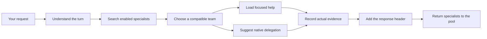

# Agency Runtime

Give your coding agent a bench of specialists without turning every conversation
into a giant prompt.

Agency Runtime connects to Codex, Claude Code, Hermes, and OpenClaw. For each
request, it searches an audited roster, chooses the most relevant compatible
specialist or specialists, and gives the host a focused delegation plan. The
specialist instructions apply to that turn or child task and then leave the
active context.

You get:

- dynamic selection across the complete enabled roster;
- smarter routing with optional model-based inference;
- conflict checks before multiple specialists are combined;
- native delegation guidance without replacing the host's own scheduler;
- a six-line response header showing what actually ran;
- a local dashboard for live activity, configuration, and controls;
- the same configuration and controls from the CLI;
- Windows and Linux support.

Agency Runtime is prerelease software. Install it from this repository; no
public package release is claimed yet.

## How it works (ELI5)

Imagine your main agent has a company directory of 263 specialists.

1. You ask the main agent for something.
2. Agency figures out whether this is a new task, a follow-up, an approval, a
   revision, a control command, or ordinary conversation.
3. It searches every approved, enabled specialist and chooses the smallest team
   that fits the work.
4. If two specialists would give conflicting instructions, Agency separates
   their work instead of placing both in one prompt.
5. Small focused work can be loaded into the current turn. Larger or independent
   work is recommended for native delegation by Codex, Claude, Hermes, or
   OpenClaw.
6. A delegated child runs its own selection for its exact assignment.
7. Agency records what really loaded, delegated, and returned model evidence.
8. The final response shows that evidence in a compact header. On the next
   request, the specialists return to the pool.

The Agents Orchestrator and Chief of Staff form a small permanent coordination
layer. They do not replace domain specialists, and their full upstream prompts
are not repeatedly injected into every turn.



## Supported hosts

| Host | Integration | Notes |
|---|---|---|
| Codex | Native plugin, hooks, MCP, controls, canary | Installation guides hook approval and verifies a normal Codex profile before reporting ready. |
| Claude Code | Native plugin, hooks, MCP, controls, canary | Uses Claude's native plugin and Stop behavior. |
| Hermes | Native Python plugin and commands | Supports direct `/agency` controls. |
| OpenClaw | Native JavaScript plugin | Supported for the audited `2026.7.x` stable line at patch 1 or newer. |
| Other tools | MCP or explicit CLI adapter | Generic command execution must be configured explicitly. |

All four native integrations have deterministic Windows and Linux contract
coverage. Live status is reported separately, so a copied plugin directory is
never presented as proof that a host loaded it. Run `agency doctor --json` to
see what is installed and verified on your machine.

## Install

Python 3.10 or newer is required.

```bash
git clone https://github.com/Holeshot-Software-LLC/agency-runtime.git
cd agency-runtime
python -m pip install .

agency --version
agency configure --non-interactive --profile standard
agency install --all --dry-run
agency install --all
agency install --agent codex --verify-activation
agency smoke --all --json
agency doctor
```

The installer discovers supported hosts and registers only the ones it can
identify. It does not restart a host automatically.

Codex requires you to approve command hooks. Agency will install the plugin,
report `activation_required`, and give you the exact next step. Open a terminal,
run `codex`, and choose **Trust all and continue** when the Codex terminal UI
shows its startup hook review. If that review does not appear, run `/hooks`
inside the terminal UI and trust the seven Agency Runtime events. Codex
Desktop's `/hooks` screen may show connector setup such as Zoom or Twilio; that
is not the local command-hook trust screen. Then finish the same install flow
with:

```bash
agency install --agent codex --verify-activation
```

That verification starts a harmless normal-profile Codex session without the
hook-trust bypass. Installation reports Codex as ready only when routing,
specialist evidence, finalization, and the six-line header all appear. The
installer never edits Codex's trust state for you.

The dashboard is installed by default as a service for the current user. It
does not require administrator access. To install only the runtime and host
integrations:

```bash
agency install --all --no-dashboard
```

Install or roll back one host:

```bash
agency install --agent codex --dry-run
agency install --agent codex
agency install --agent codex --verify-activation
agency install --agent codex --rollback
```

Managed files and backups live under `~/.agency-runtime/`. Native host files
use the normal host locations under the current user's home directory.

## Everyday commands

Check the system:

```bash
agency status
agency doctor --json
agency smoke --all --json
agency agents list
agency roster list
```

Try routing without changing a host session:

```bash
agency search "incident response"
agency route "review this authentication design"
agency explain "review this authentication design" --session-id demo
```

Enable or disable Agency for one host:

```bash
agency status --agent codex
agency off --agent codex
agency on --agent codex
```

Turn Agency off or on everywhere while keeping plugins, configuration, and
history in place:

```bash
agency off --global
agency on --global
```

Start a new host session after changing the global switch. An existing model
conversation cannot forget instructions that were already placed in its
context.

Every specialist is enabled by default. You can disable any optional specialist
without deleting it:

```bash
agency agents disable code-reviewer
agency agents enable code-reviewer
```

`agents-orchestrator` and `chief-of-staff` are the protected coordination pair
and cannot be disabled.

## Operations dashboard

The optional dashboard is a local, animated view of routing, delegation,
provider health, model receipts, host status, roster changes, and recent
activity. It also provides the same configuration and enable/disable controls
as the CLI.

Manage the installed service:

```bash
agency dashboard service status
agency dashboard service open
agency dashboard service restart
agency dashboard service uninstall
agency dashboard service install
```

Or run it in the foreground on Windows or Linux:

```bash
agency dashboard
agency dashboard --no-open
agency dashboard --port 7801
```

The dashboard listens only on your computer and uses a fresh access token. Its
service runs as the current user through Task Scheduler on Windows or
`systemd --user` on Linux. Configuration changes are validated and written
atomically, and stale browser tabs must refresh before overwriting a newer CLI
change.

## Configure routing and inference

Start the guided setup or inspect the current configuration:

```bash
agency configure
agency config show
agency config validate
agency config path
```

Agency works with deterministic routing alone. When an inference provider is
configured, semantic selection uses it whenever the turn requires an inference
decision. Supported local CLI providers can reuse an authenticated Codex or
Claude session. OpenAI-compatible endpoints and ordered fallback chains are also
supported.

Example provider chain:

```yaml
providers:
  - name: codex-cli
    type: cli
    transport: codex
    model: ""
    timeout: 15
  - name: local-compatible
    type: openai-compatible
    model: local-model
    base_url: http://127.0.0.1:1234/v1
    timeout: 15
```

Set a model or enter a secret without placing it on the command line:

```bash
agency config set judge.model qwen3.5:2b
agency config set judge.api_key --prompt
agency config set judge.api_key --clear
```

If a configured inference chain is unavailable, Agency reports that selection
is degraded instead of pretending deterministic candidates were model-selected.
An optional, unconfigured local model may be unavailable while deterministic
routing continues normally.

Default files:

- configuration: `~/.agency-runtime/agency.yaml`
- database: `~/.agency-runtime/agency.db`
- global switch: `~/.agency-runtime/run/control.json`

Use `AGENCY_CONFIG_PATH` or `AGENCY_DB_PATH` to choose another location.

## Response header

Agency-enabled responses start with six evidence fields:

```text
Agency/Agencies loaded: code-reviewer
Agency/Agencies delegated: none
Skills loaded: none
Actual Model selected: gpt-5.6-sol -> unavailable - no model receipt recorded
Why: The request needed a focused code review.
How it shaped outcome: The review emphasized correctness and regression risk.
```

The header is built from the current turn's receipts. A recommendation is not
reported as a delegation, and a requested model is not reported as the actual
model unless the host or router provides matching evidence. With LiteLLM, the
verified router name is kept alongside the reconciled provider/model result.

When Agency is globally off, the host runs normally without Agency routing or
the Agency header. This makes clean A/B testing possible.

## Verify an installed host

The default canary command is read-only:

```bash
agency host-canary codex
```

Run an isolated live Codex canary only with its exact confirmation:

```bash
agency host-canary codex --execute --confirm "RUN LIVE codex CANARY"
```

For a native-only comparison, disable Agency globally, run the native-only
canary, and always restore Agency afterward:

```bash
agency off --global
agency host-canary codex --mode native-only --execute \
  --confirm "RUN LIVE codex NATIVE-ONLY CANARY"
agency on --global
```

The canary uses an isolated host profile. It proves the installed integration
path without changing the real profile's trust settings.

## Roster updates and quarantine

New or changed agent definitions never become active just because they were
downloaded. Ingestion scans them, compares them with the active roster, and
places them in a review queue.

Known source defects can be repaired during ingestion only when an exact,
content-hash-bound repair rule exists. The repaired result is scanned again and
still requires normal review and approval. Unknown or changed defects stay in
quarantine with a clear reason; Agency does not guess at a cleanup.

Useful maintainer commands:

```bash
agency roster upstream status --source-id <source-id>
agency roster upstream import --source-id <source-id> --dry-run
agency roster upstream import --source-id <source-id> --source-revision <git-sha>
agency roster remediation queue --limit 50
agency roster candidate findings <candidate-id>
agency roster candidate compare <candidate-id>
agency roster candidate audit <candidate-id>
```

The bundled roster currently contains 263 approved agents and no unresolved
quarantined definitions eligible for routing.

## MCP and LiteLLM

Run Agency as a standard MCP stdio server:

```bash
agency mcp
agency mcp --db ~/.agency-runtime/alternate.db
```

Codex and Claude installations configure the packaged MCP server automatically.
Other MCP clients can launch the same command.

For LiteLLM SDK users:

```python
from agency_runtime.adapters.litellm import register_litellm_callback

registration = register_litellm_callback()
if not registration.registered:
    raise RuntimeError(registration.reason)
```

For LiteLLM Proxy:

```yaml
litellm_settings:
  turn_off_message_logging: true
  callbacks: agency_runtime.adapters.litellm.callback.proxy_handler_instance
```

## Privacy and security

Agency stores metadata rather than prompt or response content by default.
Content capture is opt-in and should be enabled only after reviewing the data
impact. Dashboard access stays local to the current computer and requires its
session token.

Imported agent files are treated as untrusted input. Paths, file identities,
processes, provider URLs, credentials, and configuration updates are checked
before use. When Agency cannot verify an operation safely, it stops that
operation and explains what needs attention.

Report vulnerabilities privately as described in [SECURITY.md](SECURITY.md).

## Troubleshooting

Start here:

```bash
agency doctor --json --verbose
agency dashboard service status
agency config validate
agency smoke --all --json
```

Common fixes:

- Start a new host session after install or after changing Agency controls.
- In Codex, run `/hooks`, review the seven Agency events, trust them, and start
  a new session.
- If the dashboard service is unavailable, use `agency dashboard` in the
  foreground or reinstall with `--no-dashboard`.
- If a host is shown as discovered but not registered, rerun
  `agency install --agent <host>` and inspect the returned status.
- If configuration changed to a different database, restart the dashboard
  service so it opens the new database.

See [docs/TROUBLESHOOTING.md](docs/TROUBLESHOOTING.md) for detailed diagnostics.

## Development

```bash
python -m pip install -e ".[dev]"
ruff check agency_runtime tests scripts
ruff format --check agency_runtime tests scripts
python -m pytest tests -q -W error
node --test tests/dashboard_ui.test.mjs
agency eval routing --json --no-details
agency eval full-roster --json --no-details
```

See [CONTRIBUTING.md](CONTRIBUTING.md) for the full development and review
workflow, [CHANGELOG.md](CHANGELOG.md) for release history, and
[docs/TROUBLESHOOTING.md](docs/TROUBLESHOOTING.md) for operations help.

## License

MIT. See [LICENSE](LICENSE).
