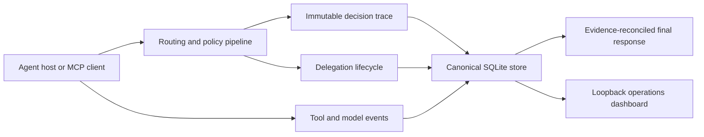

# Agency Runtime

Agency Runtime is a local control plane for specialist routing, delegation,
roster governance, and evidence about what an AI-agent host actually did. It
runs as a Python package, keeps durable state in SQLite, and can integrate with
Codex, Claude Code, Hermes, OpenClaw, LiteLLM, MCP clients, or an explicitly
configured generic command.

The project is prerelease software. Installation from this repository is the
canonical distribution path; there is no claim that a package has been
published to a public index.

## What is production-gated

Agency Runtime does not treat generated files as proof of a working host
integration. Host support has two independent dimensions:

1. **Contract coverage** proves bundle layouts, hook translations, native
   lifecycle commands, failure handling, MCP protocol behavior, and Windows /
   POSIX process construction in deterministic tests.
2. **Live maturity** advances only when native inventory proves discovery,
   registration, enablement, loading, and a canary where the host exposes one.

The v1 target matrix is Codex, Claude Code, Hermes, and OpenClaw on native
Windows and Ubuntu/WSL. All four have deterministic v1 host-contract coverage.
That does not by itself mean all four were live-tested on this machine or on
both operating systems.

### Current verification snapshot

This checkout was inspected on 2026-07-13. These are dated local results, not a
substitute for the final hosted release matrix:

| Environment / host | Contract evidence | Live evidence in this checkout |
|---|---|---|
| Windows / Python | Warning-strict suite and exact line/branch coverage | `2303 passed`, `5 skipped`, and `2` performance tests deselected. All `17,284` statements and `5,408` branches were covered with zero missing lines or partial branches (`100.00%`). |
| Ubuntu 24.04 WSL / Python 3.12 | Native ext4 full-suite and performance execution | `2215 passed`, `16 skipped`; the separate performance run passed both tests. No Linux host was installed, so no live Linux host maturity is claimed. |
| Routing and delegation | Versioned offline routing, policy, delegation-detection, DAG, concurrency, and latency gates | All `25` routing gates passed: precision@3 `0.9744`, required recall/top-1/top-k `1.0`, and policy macro F1 `0.9958`. Delegation passed `12/12`; the final 1,000-agent benchmark measured p95 `8.640 ms`, cache p95 `0.385 ms`, `155.73` calls/second, and overlap `8`. |
| Dashboard | Authenticated server, lifecycle, configuration, accessibility, and modular browser contracts | All `60/60` JavaScript tests passed at `100.00%` line, branch, and function coverage. Authenticated Chrome smoke loaded all seven scripts, rendered host cards, refreshed live state, re-enabled the control, and produced no application console errors. |
| Codex 0.144.1 on native Windows | Deterministic bundle, hook, MCP, lifecycle, `.CMD` launch, rollback, and isolated-canary contracts | Agency Runtime is registered and enabled. An exact-confirmed native isolated-profile canary exited `0`, produced a valid six-line header with no missing fields, recorded one correlated routing event and one finalization, and persisted the attestation for trace `019f5bdd-612d-70c0-b369-2b038faa3d02`; it recorded no model receipt. A live keyless judge selection used `codex-cli (cli:codex)` with confidence `0.87` in `6880 ms`; the installed `$agency status` skill loaded and called `agency.host_status`; live CLI `off`/`on` succeeded and ended enabled. Real-profile command-hook trust remains a manual `/hooks` review, is reported as `unverified`, and is not promoted to `runtime-verified` by the isolated result. |
| Claude Code on native Windows | Deterministic bundle, hook, MCP, lifecycle, and rollback tests | Host absent |
| Hermes on native Windows | Deterministic native plugin, lifecycle, delegation, and rollback tests | Host absent |
| OpenClaw on native Windows | Deterministic JavaScript bundle, JSON bridge, lifecycle, runtime-inspection, and rollback tests | Host absent |

Run `agency doctor --json` for current evidence. A local result may differ from
the snapshot above.

## Architecture



The selector fingerprints the active roster, full selector/provider
configuration, and companion policy. Cache and session reuse are rejected when
that fingerprint changes. Zero-signal requests abstain instead of selecting an
arbitrary agent. Every routing call receives a fresh trace identity even when
the selection result came from cache.

Runtime claims are failure-aware. A specialist load, delegation, model receipt,
or final response is not promoted to success merely because a tool was called.
Delegations correlate to a stable work-unit identity; failed prerequisites skip
dependents; and the final header is reconciled against canonical evidence rather
than trusting model-authored claims.

## Install

Python 3.10 or newer is required.

```bash
git clone https://github.com/Holeshot-Software-LLC/agency-runtime.git
cd agency-runtime
python -m pip install .
agency smoke --all --json
agency configure --non-interactive --profile standard
agency install --all --dry-run
agency install --all
agency doctor
```

This installs an ordinary wheel-backed environment from the checkout. Use the
editable development extras and full test matrix documented in
[CONTRIBUTING.md](CONTRIBUTING.md) only when contributing code.

`agency install --all` discovers hosts from their executable or a current
native-state marker. A bare historical configuration directory is reported as
`stale-config` and is not selected automatically. Use `--agent` for an explicit
single-host operation:

```bash
agency install --agent codex --dry-run
agency install --agent codex
agency install --agent codex --rollback
agency install --agent codex --rollback --backup <retained-backup-path>
```

Installation also registers and starts the optional dashboard for the current
operating-system user: Task Scheduler on Windows and `systemd --user` on Linux.
It never requests an administrator/system service. Opt out without probing or
changing the service manager:

```bash
agency install --all --no-dashboard
```

The dry run writes nothing and includes the exact dashboard-service plan. A
real install stages a complete managed tree
atomically, moves the previous managed tree to a timestamped backup, and then
uses the host's native plugin lifecycle. Native registration failure returns a
nonzero partial-failure result; staged files are never reported as registered.
The installer never restarts a host automatically. In particular, OpenClaw
installation stops when a live gateway is proven and requires the operator to
schedule the restart.

The dashboard service is also fail-honest: if Task Scheduler or the Linux user
manager is unavailable, installation reports that component incomplete and
returns nonzero. The foreground dashboard remains usable, or rerun with
`--no-dashboard` after reviewing the limitation.

### Installed paths

| Host | Managed source path | Native lifecycle |
|---|---|---|
| Hermes | `~/.hermes/plugins/agency-preflight/` | `hermes plugins` |
| OpenClaw | `~/.agency-runtime/host-plugins/openclaw/agency-preflight/` | `openclaw plugins` |
| Codex | `~/.agency-runtime/marketplaces/codex/` | `codex plugin` |
| Claude Code | `~/.agency-runtime/marketplaces/claude/` | `claude plugin` |

Codex and Claude bundles contain their host-native marketplace manifest, plugin
manifest, hook contract, `.mcp.json`, and an Agency control skill. OpenClaw
receives a native JavaScript package that invokes the installed Python runtime
through bounded JSON. Hermes receives its native Python plugin manifest, hook
registration, and direct command registration. Backups live under
`~/.agency-runtime/backups/<host>/`.

Codex intentionally does not trust command hooks merely because a plugin was
installed or enabled. Agency Runtime's generated-bundle smoke validates the
expected events, commands, and timeout schema, while native plugin inventory
proves registration and enablement. Installation, status, and doctor
conservatively report hook trust as `unverified` with the required action; they
do not query or mutate Codex's live trust store. The operator must open
`/hooks`, review and trust the three Agency hooks, and then start a new
session. The exact-confirmed isolated canary may request Codex's explicit
one-invocation trust bypass; that is scoped to the canary and is never persisted
or used as installation policy.

### Installation maturity

`agency doctor`, the installer JSON output, and the dashboard use the same
evidence vocabulary:

| Maturity | Meaning |
|---|---|
| `absent` | No executable, current native state, stale root, or managed stage was found |
| `stale-config` | A host root exists, but no executable or current native marker proves an installed host |
| `host-discovered` | An executable or current native state was found; Agency Runtime is not registered |
| `staged-not-registered` | The managed bundle exists, but native inventory does not prove registration |
| `registered-disabled` | Native inventory proves registration and disablement |
| `registered-enablement-unverified` | Registration is proven; enablement is not exposed or not proven |
| `enabled-runtime-unverified` | Registration and enablement are proven; a loaded runtime is not |
| `runtime-verified` | Native runtime inspection proves the integration loaded; `canary` is separately reported when supported |

Unknown values remain unknown. The system does not infer `loaded` or `canary`
from file existence.

### Enable, disable, and restore

```bash
agency status --agent codex
agency off --agent codex --dry-run
agency off --agent codex
agency on --agent codex
agency off --agent codex --native --dry-run
agency off --agent codex --native
```

The default `on` and `off` commands write a persistent host-scoped soft
control to SQLite. Every adapter reads it again at each routing, tool,
model-receipt, finalization, and verification boundary, so an already-created
adapter stops recording or shaping work after `off` and resumes after `on`.
This does not unregister the native plugin or require a host restart. It also
does not prove that the host loaded the integration in the first place.

`--native` is the explicit host-plugin lifecycle operation. It succeeds only
when post-operation native inventory proves the requested state; unknown
enablement remains unverified and may require a host restart. Neither control
mode deletes configuration, roster state, runtime evidence, or backups.

Hermes and OpenClaw bundles register a direct `/agency status|on|off` command.
Codex and Claude bundles provide the equivalent `agency status|on|off` control
skill, including a leading-slash form when the host routes it through the skill;
it calls exact-confirmed `agency.host_status` and `agency.host_control` MCP
tools. The CLI, dashboard, generated host surfaces, and MCP tools share the same
soft-control record. In the 2026-07-12 native Codex check, `$agency status`
loaded the installed skill and called `agency.host_status` successfully. Two
noninteractive chat control mutations were correctly cancelled by Codex's user-
approval layer, so live chat `on`/`off` is not claimed; direct CLI `off` and
`on` succeeded and left the integration enabled. Deterministic MCP tests cover
both control mutations.

### Host canaries

```bash
agency host-canary codex
agency host-canary codex --execute --confirm "RUN LIVE codex CANARY"
```

The default command is a read-only readiness report and never creates a
database or claims a live result. Live execution requires the exact confirmation
phrase, a discovered host and managed bundle identity, enabled soft control, a
bounded safe backend, a valid final-response header, and nonce-bound correlated
routing/finalization evidence. Prompts and host output are not stored in the
attestation.

Codex uses a private temporary `CODEX_HOME`, copies only its bounded
authentication artifact into that owner-private home, registers the managed marketplace and
plugin inside that temporary profile, ignores user configuration and project
rules, disables shell/web/app/MCP mutation surfaces, and removes the profile
afterward. Its report preserves the real profile's native registration facts
separately and records any success as `isolated-profile`; that attestation
cannot promote the real profile's `canary` state. Claude likewise copies only
its bounded credentials into a temporary `CLAUDE_CONFIG_DIR`, requests the
managed plugin explicitly, disables user/project setting sources, tools, MCP,
and session persistence, and reports it loaded/invoked only when nonce-bound
hook evidence proves that fact. It does not use Claude's `--safe-mode`, because
that mode disables the plugin and hooks being tested. Hermes and OpenClaw fail
closed because no equally safe noninteractive mode is yet proven.

A durable attestation is matched against operating system, host version, plugin
version, install ID, bundle digest, profile scope, and current native state.
Upgrade, reinstall, rollback, bundle drift, or a non-current profile makes it
stale. On 2026-07-12, the exact-confirmed Codex 0.144.1 isolated-profile canary
completed with exit code `0`, a valid six-line header, one nonce-bound routing
event, one correlated finalization, no model receipt, and a persisted
attestation. The canary's explicit one-invocation trust bypass did not trust the
real profile or establish Linux Codex maturity: operators still review the
installed hooks through `/hooks` and start a new session.

## Secure operations dashboard

The dashboard is installed as package data; Node.js and a separate web build
are not required. A normal `agency install` runs it as an optional user-scoped
service. Manage or open that service with:

```bash
agency dashboard service status
agency dashboard service open
agency dashboard service restart
agency dashboard service uninstall
agency dashboard service install --dry-run
agency dashboard service install
```

The foreground mode remains available on both Windows and Linux:

```bash
agency dashboard
agency dashboard --no-open
agency dashboard --port 7801 --db ~/.agency-runtime/agency.db
```

It binds only to loopback and creates a new high-entropy access token for each
process. Foreground mode prints the one-time URL. Service mode writes the
rotating token only to an owner-restricted runtime descriptor; the systemd unit,
scheduled task, process arguments, status output, and logs never contain it.
`agency dashboard service open` reads that descriptor and verifies the
authenticated health endpoint before opening a token-fragment URL. The browser
moves the token to session storage. The server validates `Host` and same-origin
requests, accepts mutation bodies only as JSON, sends restrictive browser
security headers, and requires exact confirmation phrases for roster, host,
retention, and configuration mutations.

The Signal Observatory overview streams bounded routing and delegation
metadata while the tab is visible, with source-owned accessible charts,
animated event transitions, provider evidence, and host posture. Polling is
single-flight, pauses with the tab or the Live control, backs off transient
failures, and stops on expired authentication instead of retrying forever.
Configuration, roster governance, and native host inspection stay outside the
fast loop.

The other views provide evidence tables, roster snapshots, an authoritative
detected dependency graph, editable redacted configuration, and a route/explain
lab. The dashboard is not a remote multi-user control plane and does not turn
cold host inventory into a live verification claim.

Dashboard and CLI configuration changes use the same typed, locked, atomic
writer. Unknown fields, invalid types/ranges, embedded URL credentials, stale
browser revisions, and redaction-marker round trips are rejected before the
file is replaced. Direct secrets are write-only:

```bash
agency config set judge.model qwen3.5:2b
agency config set judge.api_key --prompt
agency config set judge.api_key --clear
```

The Settings view exposes runtime policy, provider order, judge/Ollama,
selector, adapter, privacy, storage, HTTP, and dashboard-service port settings.
Changing a restart-bound field is reported explicitly. Enabling content capture
or switching to `local-only` requires an additional operation-specific phrase.

### Ordered judge providers

`agency configure` edits the same ordered provider chain used at runtime. A
chain contains at most four entries, matching the bounded attempt budget. When
`providers` is nonempty it is authoritative: failure of its last entry goes
directly to deterministic token routing. Legacy `judge` and separate `ollama`
fallback settings are consulted only when no typed chain exists.

```yaml
providers:
  - name: codex-cli
    type: cli
    transport: codex
    model: ""  # use the CLI's configured default
    timeout: 15
  - name: local-compatible
    type: openai-compatible
    model: local-model
    base_url: http://127.0.0.1:1234/v1
    timeout: 15
```

Supported CLI judge transports are `codex` and `claude`. They reuse an existing
authenticated local CLI session and need no Agency Runtime API key. Detection
reports installed, authenticated, and usable separately. Judge prompts travel
over standard input, are capped at 16 KiB, and are redacted recursively from
results and errors. Executions use isolated home/temp roots, a minimal
allowlisted environment plus only the selected host's authentication root, and
bounded output. Project customizations and tools are disabled through the CLI
controls the installed version exposes. Windows uses a kill-on-close Job Object;
POSIX uses an owned process group. A delegation fails if descendants outlive a
nominally successful parent. On Windows, `.cmd` and `.bat` shims never receive
user-controlled arguments; a sibling native or PowerShell entry point is used,
or the provider fails closed.

Credentialed remote provider URLs require HTTPS; literal loopback HTTP is the
only exception. Provider URLs reject embedded user information, query strings,
and fragments, and credentials are never followed through redirects. Custom
model catalogs are byte-, count-, and string-bounded, and model IDs containing
terminal control characters are rejected before display. Keyless compatible
providers are accepted only on a literal loopback endpoint.

Observability is metadata-only by default:

```yaml
observability:
  capture_content: false
  retention_days: 30
```

Set `capture_content: true` only after accepting the data-governance impact.
Supported callback capture is bounded and redacts common secrets, bearer tokens,
API keys, and email addresses; this is defensive redaction, not a guarantee that
all sensitive content can be recognized. Starting the dashboard applies the
configured runtime-retention window without deleting roster-governance data.

## MCP integration

`agency mcp` is a dependency-light MCP stdio server. It implements the
initialization handshake, tool discovery, bounded newline-delimited JSON-RPC,
structured errors, and these tools:

- `agency.preflight`
- `agency.search_agents`
- `agency.explain_selection`
- `agency.load_specialist`
- `agency.record_skill_loaded`
- `agency.delegate`
- `agency.finalize`
- `agency.status`

Run it directly for another MCP client:

```bash
agency mcp
agency mcp --db ~/.agency-runtime/alternate.db
```

The generated Codex and Claude bundles use the interpreter that installed
Agency Runtime and execute `python -m agency_runtime.server.mcp --stdio`.
Standard output is reserved for MCP protocol frames; diagnostics go to standard
error.

## LiteLLM activation

LiteLLM is optional and is not installed as a required dependency. For an SDK
process, register the callback once in every worker:

```python
from agency_runtime.adapters.litellm import register_litellm_callback

registration = register_litellm_callback()
if not registration.registered:
    raise RuntimeError(registration.reason)
```

Registration is thread-safe, idempotent, and preserves existing callbacks. It
injects preflight context where LiteLLM exposes a request hook and records
success or failure receipts without turning callback failures into model-traffic
failures.

For LiteLLM Proxy, merge the following fragment into its configuration so every
worker imports the callback object:

```yaml
litellm_settings:
  turn_off_message_logging: true
  callbacks: agency_runtime.adapters.litellm.callback.proxy_handler_instance
```

The equivalent programmatic fragment is returned by
`litellm_proxy_callback_config()`. Activation still depends on
`adapters.litellm.enabled`; `false` disables it, `true` enables it, and `auto`
uses gateway discovery. Confirm liveness and authentication with `agency doctor`
instead of assuming that importing the adapter registered it.

## Generic CLI fallback

Routing, search, explanation, roster governance, SQLite evidence, and the
dashboard work without a native host plugin:

```bash
agency route "review this authentication design"
agency explain "review this authentication design" --session-id demo
agency search "incident response"
```

For delegation to an unsupported CLI, configure a `GenericCLIBackend` or
`GenericAdapter` with an explicit argv command. The unconfigured generic backend
is deliberately unavailable; it never reports a no-op as completed.

Managed Git worktree mutations use bounded owned processes with repository
hooks, inherited Git settings, fsmonitor, prompts, and recursive submodules
disabled. A repository-local or included executable filter, merge driver, diff
command, or text converter causes the mutation to fail before checkout or
staging. This intentionally includes Git LFS filters; use a reviewed manual
workflow when those repository features are required.

## Quantitative routing evaluation

The versioned offline gate is reproducible and does not call a network model:

```bash
agency eval routing
agency eval routing --json --no-details
```

Corpus v1.3 contains 37 routing cases, 30 policy cases, and 22
delegation-detection cases. The checked-in gates are:

| Area | Gate |
|---|---|
| Routing | precision@3 ≥ 0.75; required recall@3 ≥ 0.97; top-k accuracy ≥ 0.95; top-1 accuracy ≥ 0.90; forbidden-case rate = 0; abstention accuracy = 1.0 |
| Policy | required recall ≥ 0.95; case accuracy ≥ 0.95; forbidden-case rate = 0; resolved-companion recall = 1.0; resolved-companion case accuracy = 1.0 |
| Delegation | decision accuracy ≥ 0.94; count accuracy ≥ 0.90; source accuracy ≥ 0.90 |
| Performance | deterministic narrowing and p95 ≤ 20 ms for the 1,000-agent microbenchmark; concurrent overlap ≥ 2; internal concurrency probe synchronized |

These are release regression gates, not a claim of universal accuracy. Changing
the corpus, metric definitions, or thresholds requires a version change and a
durable decision record.

## Configuration and storage

Defaults:

- Configuration: `~/.agency-runtime/agency.yaml`
- SQLite: `~/.agency-runtime/agency.db`
- Profile: `standard`
- Dashboard service: installed for the current user by default; use
  `agency install --no-dashboard` to opt out
- Dashboard/content capture: disabled until explicitly opted in
- Runtime retention: 30 days when the dashboard starts, or when explicitly
  trimmed

Useful commands:

```bash
agency configure
agency configure --non-interactive --profile local-only
agency config show
agency config set judge.model qwen3.5:2b
agency config set judge.api_key --prompt
agency config validate
agency config path
agency dashboard service status
agency db stats
agency db trim --older-than-days 30 --dry-run
agency db trim --older-than-days 30
```

`local-only` disables network model adapters and still provides deterministic
token/policy routing. Provider order is configured; a failed or semantically
invalid provider response falls through without being promoted as a valid
selection.

Environment overrides include `AGENCY_CONFIG_PATH`, `AGENCY_DB_PATH`,
`AGENCY_CAPTURE_CONTENT`, `AGENCY_RETENTION_DAYS`, `AGENCY_JUDGE_MODEL`,
`AGENCY_JUDGE_BASE_URL`, `AGENCY_JUDGE_API_KEY`, `LITELLM_API_KEY`,
`OPENAI_API_KEY`, `ANTHROPIC_API_KEY`, and `OLLAMA_BASE_URL`.
`AGENCY_DASHBOARD_PORT` overrides the fixed user-service port.

The default `~/.agency-runtime` directory is an Agency Runtime-owned private
directory. When a custom config or database path points into a pre-existing
shared directory, Agency Runtime does not chmod that directory or replace its
ACL. It still hardens the config/database files and SQLite sidecars themselves,
fails closed when a private Windows file DACL cannot be enforced, and rejects a
database path that is a symlink or reparse point. The operator remains
responsible for access to a custom parent directory. A Windows restricted
process may reuse an existing DACL only after verifying the exact owner-only
shape, including a recursively private parent for inherited SQLite sidecars. If
a permission change is required, a restricted token is rejected before any DACL
mutation; rerun that operation from an unrestricted user process or an
explicitly approved host action. Agency Runtime never keeps broader inherited
access merely to make that operation appear successful.

## Roster governance

Imported JSON, YAML, or Markdown roster data moves through quarantine, diff,
approval, and activation. Nothing downloaded becomes active merely because a
sync ran.

```bash
agency source add examples/rosters/agents.json --name local-example
agency sync --dry-run
agency sync --review
agency roster approve <snapshot-id>
agency roster activate <snapshot-id>
agency roster list
```

`--auto-approve` is fail-closed and requires every enabled source to be marked
trusted. Repository examples are self-contained; the runtime does not depend on
a sibling repository.

### Companion-policy availability

The bundled starter roster contains seven governed specialists, including
dedicated internationalization, payments and billing, and test-automation
roles. The broad companion policy references 238 unique specialists across
action routes and division anchors. Seven are required bundled specialists; the
other 231 are explicitly roster-gated. A roster-gated route stays disabled with
a recorded reason until an approved active roster supplies that specialist.

`agency policy` validates both action and division routes against the active
roster. Its JSON form reports enabled, disabled, and invalid routes, and the
command exits nonzero when a required specialist is absent, a route lacks an
availability declaration, or the policy structure is malformed:

```bash
agency policy --json
python scripts/update_policy_availability.py --check
```

The availability block is generated deterministically from the policy. Adding
a route requires regenerating and reviewing that block, so an unresolved slug
cannot enter the enabled policy silently.

## Development and release

```bash
python -m pip install -e ".[dev]"
python scripts/docs_metadata.py --check
python scripts/update_worklog.py --check
python scripts/verify_docs.py
ruff check agency_runtime tests scripts
python -m pytest tests -q -W error
node --test tests/dashboard_ui.test.mjs
agency eval routing --json --no-details
git diff --check
```

After an authorized tracker synchronization, also run
`python scripts/verify_docs.py --require-tracker` and
`python scripts/verify_tracker.py`.

See [CONTRIBUTING.md](CONTRIBUTING.md), the
[Code of Conduct](CODE_OF_CONDUCT.md), [SECURITY.md](SECURITY.md), the
[threat model](docs/THREAT_MODEL.md), [CHANGELOG.md](CHANGELOG.md),
[troubleshooting](docs/TROUBLESHOOTING.md), and the
[release checklist](docs/RELEASE_CHECKLIST.md). Planning, worklog, and decision
records are indexed under [docs/](docs/roadmap/README.md).

## License

MIT. See [LICENSE](LICENSE).
