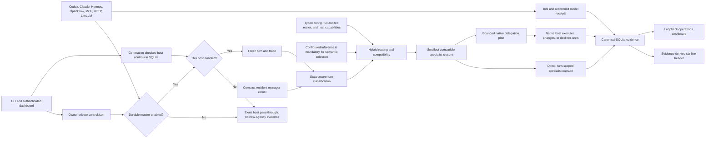
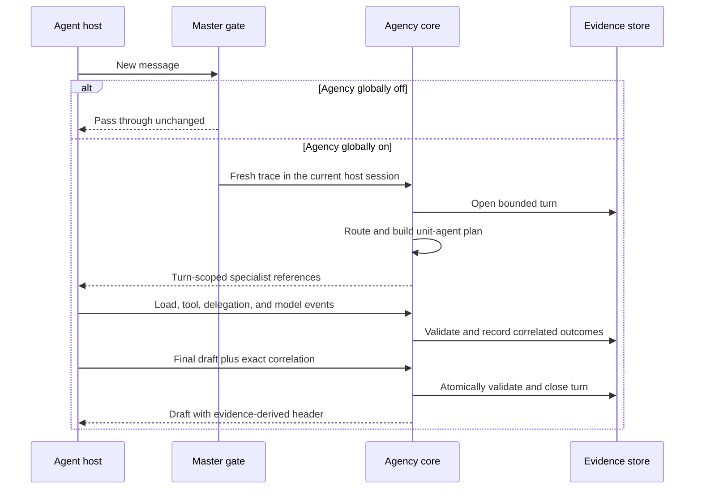
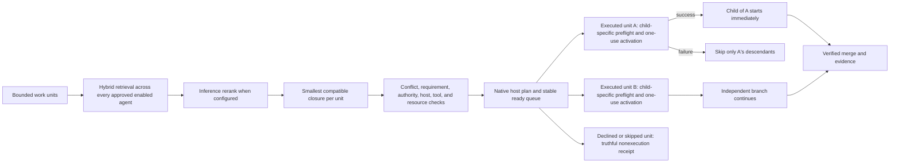

# Agency Runtime

Agency Runtime is a local control plane for specialist routing, delegation,
roster governance, and evidence about what an AI-agent host actually did. It
runs as a Python package, keeps durable state in SQLite, and can integrate with
Codex, Claude Code, Hermes, OpenClaw, LiteLLM, MCP clients, or an explicitly
configured generic command.

The project is prerelease software. Installation from this repository is the
canonical distribution path; there is no claim that a package has been
published to a public index.

## What is production-gated

Agency Runtime does not treat generated files as proof of a working host
integration. Host support has two independent dimensions:

1. **Contract coverage** proves bundle layouts, hook translations, native
   lifecycle commands, failure handling, MCP protocol behavior, and Windows /
   POSIX process construction in deterministic tests.
2. **Live maturity** advances only when native inventory proves discovery,
   registration, enablement, loading, and a canary where the host exposes one.

The v1 target matrix is Codex, Claude Code, Hermes, and OpenClaw on native
Windows and Ubuntu/WSL. All four have deterministic v1 host-contract coverage.
That does not by itself mean all four were live-tested on this machine or on
both operating systems.

### Current source-tree verification snapshot

The current source tree was inspected on 2026-07-20 before hosted review. These
receipts describe the exact local tree and explicitly identified live canaries;
they do not substitute for hosted artifact parity, reviewed merge evidence, or
the final merged-artifact installation:

| Environment / host | Evidence boundary | Dated receipt |
|---|---|---|
| Windows / Python 3.13 | Warning-strict full suite and exact line/branch coverage | `6873 passed`, `35` expected skips, and `3` performance tests deselected. All `44,046` statements and `14,986` branches were covered with zero misses or partial branches (`100.00%`). The separate uninstrumented performance run passed `3/3`. |
| Ubuntu 24.04 WSL / Python 3.12 | Live native owned-process lifecycle proof | `12/12` Linux lifecycle regressions passed, including two-phase execution gating, pre/post-commit interruption, session-escaping descendants, unrelated-sibling preservation, supervisor resource protections, own-child operations, terminal receipts, and native signal restoration. The complete hosted Linux matrix remains a CI gate; no Linux agent host is installed, so no live Linux host maturity is claimed. |
| Routing and delegation | Versioned offline routing, policy, delegation-detection, DAG, concurrency, and latency gates | All `25` routing gates passed: precision@3 `0.9744`, required recall/top-1/top-k `1.0`, policy macro F1 `0.9958`, and every delegation metric `1.0`. Delegation contracts passed `12/12`; the Windows 1,000-agent benchmark measured p95 `2.369 ms`, cache p95 `0.852 ms`, `112.02` calls/second, and overlap `8`. |
| Complete roster | Contract-only full-roster participation, retrieval, compatibility, and turn-state evaluation | All `263` approved and enabled agents participated in lexical and semantic retrieval; candidate and top-10 recall, curated accuracy, abstention, compatibility, and turn-state accuracy were `1.0`. Identity leakage and preferred-sentence copying were `0.0`. This does not claim live task quality or superiority. |
| Dashboard | Authenticated server, lifecycle, configuration, accessibility, and modular browser contracts | All `88/88` JavaScript tests passed at `100.00%` line, branch, and function coverage across all seven dashboard modules. |
| Codex on native Windows | Deterministic bundle, hook, MCP, lifecycle, `.CMD` launch, rollback, and isolated-canary contracts | Codex CLI `0.144.3` is currently installed. The last exact-confirmed isolated-profile header canary remains the dated `0.144.1` run: it exited `0`, produced the complete six-line header, recorded one correlated routing event and one finalization, and persisted trace `019f5bdd-612d-70c0-b369-2b038faa3d02` without a model receipt. The final `0.144.3` canary is rerun only after installing the merged artifact. Real-profile command-hook trust remains a manual `/hooks` review and is not promoted by an isolated result. |
| Claude Code on native Windows | Deterministic bundle, hook, MCP, lifecycle, and rollback tests | Host absent |
| Hermes on native Windows | Deterministic native plugin, lifecycle, delegation, and rollback tests | Host absent |
| OpenClaw on native Windows | Deterministic JavaScript bundle, JSON bridge, lifecycle, runtime-inspection, and rollback tests | Host absent |

Run `agency doctor --json` for current evidence. A local result may differ from
the snapshot above.

## ELI5: how Agency Runtime works

Think of your coding agent as a smart generalist with a small operations desk
beside it:

1. A new message arrives from Codex, Claude Code, Hermes, OpenClaw, or another
   supported client.
2. Agency first checks one big on/off switch and then that host's smaller
   switch. If either is off, the message passes through without Agency routing,
   delegation, or evidence work.
3. If it is on, Agency classifies the turn from durable state: acknowledgement,
   conversation, control, continuation, new intent, or revision. A short `yes`
   can therefore mean authorization, and `fix auth` cannot disappear through a
   character-count shortcut.
4. The parent keeps a compact Agents Orchestrator and Chief of Staff contract.
   Whenever the typed classification requires specialist consideration, Agency
   considers the complete approved enabled roster and, when inference is
   configured, requires a bounded inference decision.
5. Agency chooses the smallest sufficient compatible set. Hard conflicts are
   rejected before prompt hydration; useful but incompatible roles become
   separate work units instead of competing instructions in one context.
6. Agency loads one focused specialist into the parent or recommends native
   delegation for substantial work. The host—not Agency—decides whether and how
   to spawn, schedule, recover, or decline those units. Every native child reruns
   selection for its exact bounded task.
7. Agency records what actually happened. It does not treat “we planned to use
   an agent” as proof that the agent loaded or completed work.
8. Before the answer leaves, Agency builds the six-line header from those
   receipts. The next message starts fresh; old loaded-agent instructions remain
   history, not active context.

The dashboard is the window into that desk. It shows live, bounded metadata and
controls the same configuration and master switch as the CLI. It is optional,
local to the current user, loopback-only, and can be omitted with
`agency install --no-dashboard`.

## Architecture



### One turn, from message to final answer



### Full-roster selection and native delegation



The selector fingerprints the active roster, full selector/provider
configuration, and companion policy. Cache and session reuse are rejected when
that fingerprint changes. Zero-signal requests abstain instead of selecting an
arbitrary agent. Every routing call receives a fresh trace identity even when
the selection result came from cache.

Runtime claims are failure-aware. A specialist load, delegation, model receipt,
or final response is not promoted to success merely because a tool was called.
Delegations correlate to a stable work-unit identity; failed prerequisites skip
dependents; and the final header is reconciled against canonical evidence rather
than trusting model-authored claims.

Specialist and skill activation is scoped to the current turn trace, while the
session retains bounded append-only history for audit and the dashboard. A new
turn never inherits active header evidence from an earlier turn. A genuine
no-match, justified abstention, or configured-inference failure remains explicit
and falls back to the compact resident `agents-orchestrator` and
`chief-of-staff` binding; it does not pretend semantic routing matched or append
their complete upstream prompts to a substantive route. On isolated hosts,
selection is a plan rather than load evidence. Only a work unit that the native
host actually executes must consume its exact one-use activation and reconcile
it with a native worker or run receipt. Declined, skipped, or retry-exhausted
units close with truthful nonexecution evidence; a host-merged unit is recorded
as skipped with a bounded merge reason. Resident
managers are reported from their compact binding, not fabricated as ordinary
prompt loads.

### Current-turn evidence header

When Agency is enabled and the host reaches its finalization boundary, the
response begins with exactly these six fields:

```text
Agency/Agencies loaded: <current-turn evidence>
Agency/Agencies delegated: <executed native delegations or none>
Skills loaded: <current-turn evidence or none>
Actual Model selected: <requested/router -> authoritative provider/model, or unavailable reason>
Why: <bounded routing reason>
How it shaped outcome: <bounded concrete effect>
```

The first four values come only from authoritative evidence for the correlated
current trace; they are never copied from session history or repaired by
rewriting a model-authored claim. A recommendation is not delegation. The
resident managers appear only when their current parent binding affected the
turn. A LiteLLM router remains distinct from the reconciled actual
provider/model, and missing model telemetry remains unavailable. When Agency is
globally disabled, the integration bypasses routing, evidence retries, and the
header requirement for a clean native-host comparison.

## Install

Python 3.10 or newer is required.

```bash
git clone https://github.com/Holeshot-Software-LLC/agency-runtime.git
cd agency-runtime
python -m pip install .
agency --version
agency smoke --all --json
agency configure --non-interactive --profile standard
agency install --all --dry-run
agency install --all
agency doctor
```

This installs an ordinary wheel-backed environment from the checkout. Use the
editable development extras and full test matrix documented in
[CONTRIBUTING.md](CONTRIBUTING.md) only when contributing code.

`agency install --all` discovers hosts from their executable or a current
native-state marker. A bare historical configuration directory is reported as
`stale-config` and is not selected automatically. Use `--agent` for an explicit
single-host operation:

```bash
agency install --agent codex --dry-run
agency install --agent codex
agency install --agent codex --rollback
agency install --agent codex --rollback --backup <retained-backup-path>
```

Installation also registers and starts the optional dashboard for the current
operating-system user: Task Scheduler on Windows and `systemd --user` on Linux.
It never requests an administrator/system service. Opt out without probing or
changing the service manager:

```bash
agency install --all --no-dashboard
```

The dry run writes nothing and includes the exact dashboard-service plan. A
real install stages a complete managed tree
atomically, moves the previous managed tree to a timestamped backup, and then
uses the host's native plugin lifecycle. Native registration failure returns a
nonzero partial-failure result; staged files are never reported as registered.
The installer never restarts a host automatically. In particular, OpenClaw
installation stops when a live gateway is proven and requires the operator to
schedule the restart. OpenClaw support is deliberately qualified to the audited
`2026.7.x` stable release line at patch `1` or newer. Older versions,
prereleases, and later release lines fail closed until their hook and delivery
semantics are requalified.

The dashboard service is also fail-honest: if Task Scheduler or the Linux user
manager is unavailable, installation reports that component incomplete and
returns nonzero. The foreground dashboard remains usable, or rerun with
`--no-dashboard` after reviewing the limitation.
Linux unit reads and mutations remain inside one trusted absolute XDG
configuration root; cross-account-writable or changing ancestors fail closed.
Agency also rejects supported runtime or credential variables exported only by
the systemd user manager, reporting names without exposing values.

### Installed paths

| Host | Managed source path | Native lifecycle |
|---|---|---|
| Hermes | `~/.hermes/plugins/agency-preflight/` | `hermes plugins` |
| OpenClaw | `~/.agency-runtime/host-plugins/openclaw/agency-preflight/` | `openclaw plugins` |
| Codex | `~/.agency-runtime/marketplaces/codex/` | `codex plugin` |
| Claude Code | `~/.agency-runtime/marketplaces/claude/` | `claude plugin` |

Codex and Claude bundles contain their host-native marketplace manifest, plugin
manifest, hook contract, `.mcp.json`, and an Agency control skill. OpenClaw
receives a native JavaScript package that invokes the installed Python runtime
through bounded JSON. Hermes receives its native Python plugin manifest, hook
registration, and direct command registration. Backups live under
`~/.agency-runtime/backups/<host>/`.

OpenClaw's finalization hook can request a bounded model revision but exposes no
permanent deny result after that retry budget. Agency Runtime revalidates each
attempt, records `retry_exhausted`, and uses synchronous `reply_payload_sending`
plus one-use `message_sending` dispatch seals to cancel an unverified final at
delivery. Native runtime inspection proves that the required typed hooks loaded;
it does not prove that every current or third-party channel delivery invokes
them. A trusted same-process plugin registered at the same terminal priority can
also remain later in stable hook order. Those behavioral claims require the
audited deterministic harness and a profile-bound live canary. Codex and Claude
use their native Stop contracts, including Claude's terminal stop control after
an invalid retry.

Hermes exposes a bounded `pre_verify` continuation for code-edit turns, but
no permanent-deny signal, and that gate does not run on every conversational
turn. Agency Runtime consumes at most one Hermes verification nudge, revalidates
the next draft against a fresh evidence revision, and records exact retry
exhaustion before publishing its bounded safe replacement. The mandatory
`transform_llm_output` fallback covers non-code turns and hook failures because
Hermes catches plugin exceptions and would otherwise keep the original model
output. It only publishes the finalized draft after an authoritative `accept`.
Missing or ambiguous correlation and persistence failure remain non-terminal
while still replacing the unverified draft. Explicitly disabling Agency Runtime
remains an intentional pass-through.

Codex intentionally does not trust command hooks merely because a plugin was
installed or enabled. Agency Runtime's generated-bundle smoke validates the
expected events, commands, and timeout schema, while native plugin inventory
proves registration and enablement. Installation, status, and doctor
conservatively report hook trust as `unverified` with the required action; they
do not query or mutate Codex's live trust store. The operator must open
`/hooks`, review and trust the seven Agency hook events, and then start a new
session. The exact-confirmed isolated canary may request Codex's explicit
one-invocation trust bypass; that is scoped to the canary and is never persisted
or used as installation policy.

### Installation maturity

`agency doctor`, the installer JSON output, and the dashboard use the same
evidence vocabulary:

| Maturity | Meaning |
|---|---|
| `absent` | No executable, current native state, stale root, or managed stage was found |
| `stale-config` | A host root exists, but no executable or current native marker proves an installed host |
| `host-discovered` | An executable or current native state was found; Agency Runtime is not registered |
| `staged-not-registered` | The managed bundle exists, but native inventory does not prove registration |
| `registered-disabled` | Native inventory proves registration and disablement |
| `registered-enablement-unverified` | Registration is proven; enablement is not exposed or not proven |
| `enabled-runtime-unverified` | Registration and enablement are proven; a loaded runtime is not |
| `runtime-verified` | Native runtime inspection proves the integration loaded; `canary` is separately reported when supported |

Unknown values remain unknown. The system does not infer `loaded` or `canary`
from file existence.

### Enable, disable, and restore

```bash
agency status --agent codex
agency off --agent codex --dry-run
agency off --agent codex
agency on --agent codex
agency off --agent codex --native --dry-run
agency off --agent codex --native
agency off --dry-run
agency off
agency on
agency status
agency off --global --dry-run
agency off --global
agency on --global
```

The default `on` and `off` commands write a persistent host-scoped soft
control to SQLite. Every adapter reads it again at each routing, tool,
model-receipt, finalization, and verification boundary, so an already-created
adapter stops recording or shaping work after `off` and resumes after `on`.
This does not unregister the native plugin or require a host restart. It also
does not prove that the host loaded the integration in the first place. Omit
`--agent` to apply the operation to every host that current native inventory
actually detects; stale configuration directories and absent hosts are not
silently promoted into the target set.

Each host-control status includes a `runtime_control_generation`. Mutations
compare the generation they observed and the requested state inside one SQLite
write transaction. A real transition increments it; an idempotent no-op keeps
it stable. A stale dashboard, MCP client, or concurrent CLI receives an
explicit conflict and must refresh before retrying deliberately. An all-host
CLI operation retains every per-host result and exits nonzero if any host
conflicts or fails.

On restricted Windows hosts, status and soft control keep direct Store access
as the normal path but may use the installed authenticated loopback dashboard
when the exact restricted-token ACL boundary refuses Store access. The broker
returns one complete generation-consistent host snapshot; toggles submit the
same compare-and-swap generation and exact confirmation used by the dashboard.
Missing, duplicate, malformed, stale, or mismatched broker evidence returns a
sanitized nonzero CLI result and is never retried automatically. Native
lifecycle operations are never proxied this way. Authentication alone is not a
successful mutation receipt: the returned success flag, requested state,
changed flag, top-level and nested state, and generation must all agree with
the observed transition. A no-op preserves the generation, a real change
increments it exactly once, and an effective host state cannot be enabled when
either its master or host runtime control is disabled.

`--native` is the explicit host-plugin lifecycle operation. It succeeds only
when post-operation native inventory proves the requested state; unknown
enablement remains unverified and may require a host restart. Neither control
mode deletes configuration, roster state, runtime evidence, or backups.

`--global` controls the separate Agency-wide master state before any host opens
SQLite or starts turn correlation. The durable document lives at
`~/.agency-runtime/run/control.json`; CLI and dashboard writes use the same
monotonic generation. A missing, malformed, or unverifiable document fails
enabled so file deletion cannot suppress enforcement. On restricted Windows
hosts, the runtime accepts the canonical state only after stable path and
read-only mutation-rights checks. If the CLI cannot write that owner-private
path directly, it can use only the authenticated loopback dashboard service as
a broker. A brokered master mutation must return the requested state, truthful
changed flag, and the exact legal no-op or single-increment generation before
the CLI reports success. `--global` cannot be combined with `--agent` or
`--native`.

Generated Codex and Claude hook commands bind both the canonical configuration
path and the canonical master-control path explicitly. This keeps hook behavior
stable when a host replaces `HOME` or launches hooks under a restricted Windows
token. Direct control-file validation remains primary; only that positively
identified restricted-token case may read the complete validated master state
through the authenticated local dashboard. An invalid identity or broker result
fails enabled.

Turning Agency off globally preserves plugins, config, roster, and history but
bypasses new routing, prompt activation, delegation, model receipts, and
finalization at the earliest supported host boundary. Start a fresh host session
after each change for a clean A/B comparison; a running model context cannot
forget instructions that were already injected before the switch changed.

Hermes and OpenClaw bundles register a direct `/agency status|on|off` command.
Codex and Claude bundles provide the equivalent `agency status|on|off` control
skill, including a leading-slash form when the host routes it through the skill;
it calls exact-confirmed `agency.host_status` and `agency.host_control` MCP
tools. The CLI, dashboard, generated host surfaces, and MCP tools share the same
soft-control record. In the 2026-07-12 native Codex check, `$agency status`
loaded the installed skill and called `agency.host_status` successfully. Two
noninteractive chat control mutations were correctly cancelled by Codex's user-
approval layer, so live chat `on`/`off` is not claimed; direct CLI `off` and
`on` succeeded and left the integration enabled. Deterministic MCP tests cover
both control mutations.

### Host canaries

```bash
agency host-canary codex
agency host-canary codex --execute --confirm "RUN LIVE codex CANARY"
agency off --global
agency host-canary codex --mode native-only --execute \
  --confirm "RUN LIVE codex NATIVE-ONLY CANARY"
agency on --global
```

The default command is a read-only readiness report and never creates a
database or claims a live result. Live execution requires the exact confirmation
phrase, a discovered host and managed bundle identity, enabled soft control, a
bounded safe backend, a valid final-response header, and nonce-bound correlated
routing/finalization evidence. Prompts and host output are not stored in the
attestation.

Codex uses a private temporary `CODEX_HOME`, copies only its bounded
authentication artifact into that owner-private home, registers the managed marketplace and
plugin inside that temporary profile, ignores user configuration and project
rules, disables shell/web/app/MCP mutation surfaces, and removes the profile
afterward. Its report preserves the real profile's native registration facts
separately and records any success as `isolated-profile`; that attestation
cannot promote the real profile's `canary` state. Claude likewise copies only
its bounded credentials into a temporary `CLAUDE_CONFIG_DIR`, requests the
managed plugin explicitly, disables user/project setting sources, tools, MCP,
and session persistence, and reports it loaded/invoked only when nonce-bound
hook evidence proves that fact. It does not use Claude's `--safe-mode`, because
that mode disables the plugin and hooks being tested. Hermes and OpenClaw fail
closed because no equally safe noninteractive mode is yet proven.

A durable attestation is matched against operating system, host version, plugin
version, install ID, bundle digest, profile scope, and current native state.
Upgrade, reinstall, rollback, bundle drift, or a non-current profile makes it
stale. On 2026-07-12, the exact-confirmed Codex 0.144.1 isolated-profile canary
completed with exit code `0`, a valid six-line header, one nonce-bound routing
event, one correlated finalization, no model receipt, and a persisted
attestation. Agency mode requires the authoritative global switch to be on and
projects that exact state into the isolated home. `--mode native-only` requires
the global switch to be off, then proves a nonempty native response with the
isolated plugin still registered, no valid Agency header, and zero new Agency
runtime evidence. Installed hooks also carry the real canonical control identity
explicitly, so a host that drops the canary environment still honors the global
switch. Control read failures or changes during either run fail closed.
Native-only success never writes an Agency canary attestation. Always restore
the global switch in cleanup after an A/B trial.

The canary's explicit one-invocation trust bypass did not trust the
real profile or establish Linux Codex maturity: operators still review the
installed hooks through `/hooks` and start a new session.

## Secure operations dashboard

The dashboard is installed as package data; Node.js and a separate web build
are not required. A normal `agency install` runs it as an optional user-scoped
service. Manage or open that service with:

```bash
agency dashboard service status
agency dashboard service open
agency dashboard service restart
agency dashboard service uninstall
agency dashboard service install --dry-run
agency dashboard service install
```

The foreground mode remains available on both Windows and Linux:

```bash
agency dashboard
agency dashboard --no-open
agency dashboard --port 7801 --db ~/.agency-runtime/agency.db
```

It binds only to loopback and creates a new high-entropy access token for each
process. Foreground mode prints the one-time URL. Service mode writes the
rotating token only to an owner-restricted runtime descriptor; the systemd unit,
scheduled task, process arguments, status output, and logs never contain it.
Normal Linux units also use `PrivateTmp=true`. Positively identified WSL omits
only that directive because WSL's private-tmp namespace can rewrite trusted
ancestor identities; configuration namespace validation and every other unit,
filesystem, loopback, and authentication control remain enabled.
`agency dashboard service open` reads that descriptor and verifies the
authenticated health endpoint before opening a token-fragment URL. The browser
moves the token to session storage. The server validates `Host` and same-origin
requests, accepts mutation bodies only as JSON, sends restrictive browser
security headers, and requires exact confirmation phrases for roster, host,
retention, and configuration mutations.

The Signal Observatory overview streams bounded routing and delegation
metadata while the tab is visible, with source-owned accessible charts,
animated event transitions, provider evidence, and host posture. Polling is
single-flight, pauses with the tab or the Live control, backs off transient
failures, and stops on expired authentication instead of retrying forever.
Configuration, roster governance, and native host inspection stay outside the
fast loop.

The other views provide evidence tables—including a bounded specialist-activation
history that distinguishes current from completed turns—roster snapshots, an
authoritative detected dependency graph, editable redacted configuration, and a
route/explain lab. Roster governance adds bounded filters for division,
capability, authority, host, platform, and tool; prompt-free contract,
compatibility, and revision history; and a quarantine review queue with
immutable audit findings and status history. The inference view separates the
configured provider chain, requested model or router, reconciled provider/model
receipts, and recent bounded failures. Packaged source identity and local scan
history are shown, but remote freshness remains `unverified` until a separate
sync runs, and provider status is recent persisted evidence rather than a live
health probe. The dashboard is not a remote multi-user control plane and does
not turn cold host inventory into a live verification claim.

Loading, disabled, unknown, and empty-inventory states are distinct. Until the
authoritative runtime generation arrives, the header remains neutral and its
controls remain unavailable; when no native hosts are detected, the dashboard
says so instead of rendering invented host cards. Keyboard focus, contrast,
mobile navigation, reduced motion, and forced-colors behavior are first-class
parts of the same dashboard contract.

The dashboard header exposes the Agency-wide switch and its current generation.
Mutations require the authenticated same-origin session, exact confirmation,
and the latest generation, so a stale browser cannot overwrite a newer CLI
choice. The host cards continue to show native lifecycle and host-scoped soft
control separately from the master state. Each card also carries its own
SQLite host-control generation; a stale toggle returns HTTP 409, refreshes the
card state, and does not overwrite a newer choice. Host-list and toggle
responses use the same dashboard-bound master identity, including custom
service homes.

Dashboard service installation records the exact interpreter and package-owned
`_bootstrap.py` identities and content digests in its ownership manifest.
Inspection, start, and restart revalidate those persistent launch artifacts.
Drift blocks lifecycle mutation until the reviewed package is reinstalled.

Dashboard and CLI configuration changes use the same typed, locked, atomic
writer. Unknown fields, invalid types/ranges, embedded URL credentials, stale
browser revisions, and redaction-marker round trips are rejected before the
file is replaced. Direct secrets are write-only:

```bash
agency config set judge.model qwen3.5:2b
agency config set judge.api_key --prompt
agency config set judge.api_key --clear
```

Store-backed dashboard mutations and complete routing snapshots serialize
their config identity check with the matching SQLite work. Agent toggles repeat
roster membership, confirmation, disabled-set, and active-Store checks inside
the config writer lock after revision validation, so a concurrent config write
cannot move the operation onto a different Store or policy snapshot. If a
persisted Store path now differs from the database already opened by the
service, responses expose both paths and `store_restart_required: true`;
Store-bound controls fail closed until the dashboard service restarts on the
desired path.

Per-agent availability is a reversible config policy, separate from roster
approval. Every governed agent is enabled by default. List or toggle agents
without deleting their definitions or prompt history:

```bash
agency agents list
agency agents list --json
agency agents disable code-reviewer
agency agents enable code-reviewer
agency agents disable code-reviewer --config C:\path\to\agency.yaml
```

The JSON list response is an object with `config_path` and `agents` fields so
automation can prove which policy file it changed. Configuration identity uses
one precedence order on Windows and Linux: an explicit `--config`, then
`AGENCY_CONFIG_PATH`, then the strictly validated installed dashboard-service
manifest, then `~/.agency-runtime/agency.yaml`. This keeps CLI and dashboard
controls on the same file after reboot without trusting an unowned or malformed
manifest. Canonical config and custom policy reads revalidate their real,
mutation-safe parent namespace even on cache hits. A present custom policy must
also be a current-user-owned regular file with one hard link and a stable
descriptor/path identity. POSIX group or other read access is allowed only when
those accounts cannot mutate it; Windows requires the exact current owner and a
mutation-safe DACL result. An absent default override uses the bundled policy
without paying a full ACL walk on every routing cache hit, while a newly created
override is discovered and validated on the next call.

On restricted Windows hosts, the default installed identity keeps direct Store
access as its primary path, then may use the authenticated dashboard only after
the exact restricted-token boundary refuses that access. `agents list` and
`roster list` traverse compact, bounded pages containing only slug, name,
division, enabled, and protected state. `agents enable` and `agents disable`
use a separate exact one-agent lookup and one revision-checked toggle; bulk
pages never export full selector metadata.

`search`, `route`, `explain`, and `policy` execute inside the authenticated
service against its full Store-bound routing snapshot. They return only a
bounded result summary, explanation receipt, or credential-free policy
projection rather than downloading the selector catalog into the restricted
process. Every response binds the canonical config path and revision, active
Store path, and roster snapshot. A desired Store-path change is restart-bound
and refuses these operations until the service restarts. An explicit
`--config` is never redirected. Delegation, arbitrary configuration or Store
mutation, and setup execution are never proxied; expected permission failures
return a sanitized nonzero diagnostic before execution or evidence claims.

The authenticated dashboard provides the same quick controls on roster cards.
For rosters larger than the bounded first page, its exact-slug search retrieves
one governed definition at a time and keeps that filter active across live
refreshes and revision-checked toggles.
`agents-orchestrator` and `chief-of-staff` are protected coordinators and cannot
be disabled by the CLI, dashboard, configuration API, or a hand-edited config.
Disabling any other agent is an immediate operational kill switch: versioned
prompt replay, prepared-token consumption, and completion of an affected ready
turn fail closed and require a fresh preflight.

The Settings view exposes runtime policy, provider order, judge/Ollama,
selector, adapter, privacy, storage, HTTP, and dashboard-service port settings.
Changing a restart-bound field is reported explicitly. Enabling content capture
or switching to `local-only` requires an additional operation-specific phrase.

### Ordered judge providers

`agency configure` edits the same ordered provider chain used at runtime. A
chain contains at most four entries, matching the bounded attempt budget. When
`providers` is nonempty it is authoritative. If its last entry fails during a
turn that requires selection, Agency records the bounded failures and enters an
explicit degraded state; it does not label deterministic retrieval as inferred.
Only the resident managers may coordinate that degraded turn; deterministic
candidates are not silently promoted into selected specialists. Legacy `judge`
and separate `ollama` fallback settings are
consulted only when no typed chain exists. With no configured inference,
deterministic routing remains an explicitly identified supported mode.

```yaml
providers:
  - name: codex-cli
    type: cli
    transport: codex
    model: ""  # use the CLI's configured default
    timeout: 15
  - name: local-compatible
    type: openai-compatible
    model: local-model
    base_url: http://127.0.0.1:1234/v1
    timeout: 15
```

Supported CLI judge transports are `codex` and `claude`. They reuse an existing
authenticated local CLI session and need no Agency Runtime API key. Detection
reports installed, authenticated, and usable separately. Judge prompts travel
over standard input, are capped at 16 KiB, and are redacted recursively from
results and errors. Executions use isolated home/temp roots, a minimal
allowlisted environment plus only the selected host's authentication root, and
bounded output. Project customizations and tools are disabled through the CLI
controls the installed version exposes. Windows assigns a kill-on-close Job
Object atomically at process creation; Linux uses a dedicated subreaper with
a pre-opened `/proc` children descriptor and pidfd signaling so even `setsid`
and double-fork descendants remain owned without reopening an attacker-swappable
discovery path. A delegation fails if strong containment is unavailable or
descendants outlive a nominally successful parent. On Windows, `.cmd` and `.bat`
shims never receive user-controlled arguments; a sibling native or PowerShell
entry point is used, or the provider fails closed.

Credentialed remote provider URLs require HTTPS; literal loopback HTTP is the
only exception. Provider URLs reject embedded user information, query strings,
and fragments, and credentials are never followed through redirects. Custom
model catalogs are byte-, count-, and string-bounded, and model IDs containing
terminal control characters are rejected before display. Keyless compatible
providers are accepted only on a literal loopback endpoint.

Observability is metadata-only by default:

```yaml
observability:
  capture_content: false
  retention_days: 30
```

Set `capture_content: true` only after accepting the data-governance impact.
Supported callback capture is bounded and redacts common secrets, bearer tokens,
API keys, and email addresses; this is defensive redaction, not a guarantee that
all sensitive content can be recognized. Starting the dashboard applies the
configured runtime-retention window without deleting roster-governance data.

## MCP integration

`agency mcp` is a dependency-light MCP stdio server. It implements the
initialization handshake, tool discovery, bounded newline-delimited JSON-RPC,
structured errors, and these tools:

- `agency.preflight`
- `agency.search_agents`
- `agency.explain_selection`
- `agency.prepare_delegation`
- `agency.load_specialist`
- `agency.record_skill_loaded`
- `agency.delegate`
- `agency.finalize`
- `agency.status`
- `agency.host_status`
- `agency.host_control`

`agency.host_status` returns the host soft-control generation.
`agency.host_control` requires that value as `expected_generation`; a stale
value fails rather than replacing a newer operator choice.

On Codex and Claude Code, preflight returns content-free specialist references
instead of placing full prompts in the persistent parent transcript. The parent
calls `agency.prepare_delegation` once per selected specialist and work unit and
supplies the returned one-use token to that correlated work-unit flow; an MCP
caller then uses it with `agency.load_specialist`. Use the exact work-unit ID as
Codex `task_name` or Claude `description`; completion requires the consumed
receipt to reconcile to that native tool run. The receipt records exact
capability retrieval separately from `generic-worker` execution attribution.
Because MCP does not authenticate the caller as the native child, it does not
prove which process consumed the prompt. The token authorizes the exact
preflight version and hash even if the active roster version changes before the
worker starts, but disabling the agent invalidates it immediately. It is a
scoped bearer capability, so callers must not log or reuse it.

Run it directly for another MCP client:

```bash
agency mcp
agency mcp --db ~/.agency-runtime/alternate.db
```

The generated Codex and Claude bundles use the interpreter that installed
Agency Runtime and execute `python -m agency_runtime.server.mcp --stdio`.
Standard output is reserved for MCP protocol frames; diagnostics go to standard
error.

Evidence-mutating MCP calls require explicit session and trace correlation.
`agency.preflight` creates or accepts a fresh trace and returns it to the
caller; specialist, skill, delegation, and finalization calls must carry that
same session/trace pair. Missing, cross-session, ambiguous, or terminal
correlation fails closed instead of manufacturing `none` evidence.

## LiteLLM activation

LiteLLM is optional and is not installed as a required dependency. For an SDK
process, register the callback once in every worker:

```python
from agency_runtime.adapters.litellm import register_litellm_callback

registration = register_litellm_callback()
if not registration.registered:
    raise RuntimeError(registration.reason)
```

Registration is thread-safe, idempotent, and preserves existing callbacks. It
injects preflight context where LiteLLM exposes a request hook and records
success or failure receipts without turning callback failures into model-traffic
failures. When registration omits an explicit config object, each callback
event refreshes the file-aware configuration bound to its Store. Agent
disablement, adapter enablement, skipped-model, capture, and routing-policy
changes therefore apply on the next event without restarting the worker.
A caller-supplied config remains intentionally immutable.

The requested alias, LiteLLM router/model group, provider, and reconciled
response model remain separate evidence. When authoritative response telemetry
is present, the header renders the actual provider/model together with the
router name; for example, `requested-alias -> provider/model via LiteLLM router
production-router`. Missing or failed model telemetry remains explicitly
unavailable rather than promoting the requested alias or opaque LiteLLM model
ID to actual-model truth, while a verified router is still preserved; for
example, `requested-alias -> unavailable - no resolved model telemetry via
LiteLLM router production-router`.

For LiteLLM Proxy, merge the following fragment into its configuration so every
worker imports the callback object:

```yaml
litellm_settings:
  turn_off_message_logging: true
  callbacks: agency_runtime.adapters.litellm.callback.proxy_handler_instance
```

The equivalent programmatic fragment is returned by
`litellm_proxy_callback_config()`. Activation still depends on
`adapters.litellm.enabled`; `false` disables it, `true` enables it, and `auto`
uses gateway discovery. Confirm liveness and authentication with `agency doctor`
instead of assuming that importing the adapter registered it.

## Generic CLI fallback

Routing, search, explanation, roster governance, SQLite evidence, and the
dashboard work without a native host plugin:

```bash
agency route "review this authentication design"
agency explain "review this authentication design" --session-id demo
agency search "incident response"
```

When exactly one enabled host installation has verified native inventory, CLI
route and explain bind that installation's platform and capability receipt so
candidate ranking, compatibility, and selected IDs use one context. With zero
or multiple verified hosts the operation remains an explicitly host-unproven
diagnostic; it never invents an execution environment.

For delegation to an unsupported CLI, configure a `GenericCLIBackend` or
`GenericAdapter` with an explicit argv command. The unconfigured generic backend
is deliberately unavailable; it never reports a no-op as completed.

For a multi-unit request, Agency builds one bounded, versioned assignment plan.
Each exact unit routes against the complete revision-stable approved and enabled
roster, using configured inference whenever that semantic decision is required,
then constructs its smallest sufficient compatible closure. An unmatched unit
stays unmatched; protected resident managers coordinate the parent and never
masquerade as domain workers. Agency recommends a dependency graph and stable
ready order, while the native host owns scheduling, workers, worktrees, and
recovery. A child can start as soon as its own prerequisites succeed instead of
waiting for an unrelated topological level. Failed or malformed prerequisites
skip their descendants while independent branches keep running.

Executable discovery is also part of the delegation trust boundary. Explicit
commands and `PATH` results must be absolute; empty, dot, relative, and current-
directory entries are ignored. Launch preparation rejects Windows links and
reparse points, non-files, wrong native launcher kinds, and canonical targets
inside the delegated repository. POSIX launcher symlinks resolve to their real
executable targets. Agency freezes the canonical filesystem identity of every
launch-critical executable, interpreter, or wrapper and revalidates the full
identity immediately before process creation.

Persistent generated launchers have an additional install-time contract. Host
adapter and dashboard manifests freeze both the interpreter and Agency
`_bootstrap.py` with content digests and lexical/resolved filesystem
identities. Environment-managed POSIX interpreter symlinks retain their lexical
argv spelling, while the link target and resolved file are both attested.
Install inspection marks drifted launchers stale, and dashboard start/restart
or adapter registration refuses to run them until reinstall.

Managed Git worktree mutations use bounded owned processes with repository
hooks, inherited Git settings, fsmonitor, prompts, and recursive submodules
disabled. A repository-local or included executable filter, merge driver, diff
command, or text converter causes the mutation to fail before checkout or
staging. This intentionally includes Git LFS filters; use a reviewed manual
workflow when those repository features are required.

On Windows, an unrestricted host stores ephemeral work below the normal
owner-private `~/.agency-runtime` root. A restricted Codex token that cannot
create that root may use only one capability-bound, file-identity-pinned leaf
inside the current user's canonical Codex visualization namespace. Nested
workers use a bounded unique-capability lookup in that same namespace. Each
scratch child receives a protected current-user, exact-logon, and SYSTEM DACL;
unknown or ambiguous capability roots fail closed. A process-local receipt is
never treated as authority after `exec`: every child independently reattests
the exact randomized, thread-bound allocation against its canonical host
marker, root/parent file identities, DACL, and effective-token mutation rights
before use. The repository is never a private-worktree fallback merely because
it is writable.

## Quantitative routing evaluation

The versioned offline gate is reproducible and does not call a network model:

```bash
agency eval routing
agency eval routing --json --no-details
```

Corpus v1.3 contains 37 routing cases, 30 policy cases, and 22
delegation-detection cases. The checked-in gates are:

| Area | Gate |
|---|---|
| Routing | precision@3 ≥ 0.75; required recall@3 ≥ 0.97; top-k accuracy ≥ 0.95; top-1 accuracy ≥ 0.90; forbidden-case rate = 0; abstention accuracy = 1.0 |
| Policy | required recall ≥ 0.95; case accuracy ≥ 0.95; forbidden-case rate = 0; resolved-companion recall = 1.0; resolved-companion case accuracy = 1.0 |
| Delegation | decision accuracy ≥ 0.94; count accuracy ≥ 0.90; source accuracy ≥ 0.90 |
| Performance | deterministic narrowing and p95 ≤ 20 ms for the 1,000-agent microbenchmark; concurrent overlap ≥ 2; internal concurrency probe synchronized |

These are release regression gates, not a claim of universal accuracy. Changing
the corpus, metric definitions, or thresholds requires a version change and a
durable decision record.

The complete packaged-roster contract gate is separate from those legacy corpus
metrics:

```bash
agency eval full-roster
agency eval full-roster --json --no-details
```

It verifies that every approved enabled routing card participates in both
retrievers, runs one identity-free perturbed probe per approved agent, requires
candidate recall of `1.0` and target recall@10 of at least `0.99`, and checks
curated hard negatives, abstention, compatibility/required-companion behavior,
prompt isolation, and state-aware short-turn cases. It is deterministic,
offline, and contract-only: it does not call an inference provider, run a native
host, grade task outcomes, or establish superiority.

Use the paired comparison validator only with independently collected bounded
JSONL observations:

```bash
agency eval compare --input paired-observations.jsonl
```

It validates and pairs Agency-on/native-only observations, separates live-host,
isolated, contract-only, and simulated evidence, and checks model and LiteLLM
router comparability. It does not execute either host, grade free-form output,
or claim superiority. Even its directional-claim eligibility is only a minimum
evidence gate, not a statistical conclusion.

## Configuration and storage

Defaults:

- Configuration: `~/.agency-runtime/agency.yaml`
- SQLite: `~/.agency-runtime/agency.db`
- Profile: `standard`
- Dashboard service: installed for the current user by default; use
  `agency install --no-dashboard` to opt out
- Dashboard/content capture: disabled until explicitly opted in
- Runtime retention: 30 days when the dashboard starts, or when explicitly
  trimmed

Useful commands:

```bash
agency configure
agency configure --non-interactive --profile local-only
agency config show
agency config set judge.model qwen3.5:2b
agency config set judge.api_key --prompt
agency config validate
agency config path
agency dashboard service status
agency db stats
agency db trim --older-than-days 30 --dry-run
agency db trim --older-than-days 30
```

`local-only` disables network model adapters and still provides deterministic
token/policy routing. Provider order is configured; a failed or semantically
invalid provider response falls through without being promoted as a valid
selection.

Environment overrides include `AGENCY_CONFIG_PATH`, `AGENCY_DB_PATH`,
`AGENCY_CAPTURE_CONTENT`, `AGENCY_RETENTION_DAYS`, `AGENCY_JUDGE_MODEL`,
`AGENCY_JUDGE_BASE_URL`, `AGENCY_JUDGE_API_KEY`, `LITELLM_API_KEY`,
`OPENAI_API_KEY`, `ANTHROPIC_API_KEY`, and `OLLAMA_BASE_URL`.
`AGENCY_DASHBOARD_PORT` overrides the fixed user-service port.

Relative `AGENCY_DB_PATH` and `AGENCY_POLICY_PATH` values resolve against the
directory containing the effective Agency configuration file, never against a
caller's current working directory. Absolute values remain absolute, and `~`
is expanded for the current user. The same rules apply to persisted
`store.db_path` and `companion_policy_path` values.

The default `~/.agency-runtime` directory is an Agency Runtime-owned private
directory. A custom config or database parent is never silently re-permissioned,
and every existing ancestor must exclude cross-account pathname substitution.
A config parent may retain normal read/traverse access such as POSIX `0755`,
but not group/world write access or a default ACL that can replace the config;
the config file itself is current-user-owned and hardened before parsing. A
database parent remains owner-private because SQLite creates sidecars beside
the database. Config/database files and sidecars are link-safe and
identity-checked around sensitive operations. Windows enforces the equivalent
mutation-resistant parent and owner-private file DACLs. A restricted Windows
process may reuse existing state only after proving its exact canonical,
read-only identity. If a permission change is required, rerun from an
unrestricted user process or an explicitly approved host action. Agency Runtime
never keeps broader inherited access merely to make the operation appear
successful.

## Roster governance

Imported JSON, YAML, or Markdown roster data moves through quarantine, diff,
approval, and activation. Nothing downloaded becomes active merely because a
sync ran.

```bash
agency source add examples/rosters/agents.json --name local-example
agency sync --dry-run
agency sync --review
agency roster approve <snapshot-id>
agency roster activate <snapshot-id>
agency roster list
```

`--auto-approve` is fail-closed and requires every enabled source to be marked
trusted. Repository examples are self-contained; the runtime does not depend on
a sibling repository.

Every executable roster definition needs a governed routing contract in its JSON,
YAML, or Markdown front matter. At minimum, declare bounded `authority`,
`context_mode`, and a non-empty `independence_group`, plus explicit capability,
anti-capability, task-fit, tool, host/platform, conflict/requirement, output,
evidence, model, provenance, audit, and findings fields. The example roster shows
the complete shape. Plain persona prose without that contract remains quarantined
for review.

The pinned audited bundle is also the baseline for delta-only upstream review.
These commands compare source-file hashes, quarantine only new or changed
definitions, and leave every active version untouched:

```bash
agency roster upstream status --source-id <source-id>
agency roster upstream import --source-id <source-id> --dry-run
agency roster upstream import --source-id <source-id> --source-revision <git-sha>
agency roster candidate findings <candidate-id>
agency roster candidate compare <candidate-id>
agency roster candidate audit <candidate-id>
agency roster candidate reject <candidate-id> --reason "review finding"
agency roster remediation queue --limit 50
```

Every candidate receives a deterministic security and conflict audit in the
same transaction that creates its quarantine record. Audit revisions, findings,
and candidate status transitions are immutable SQLite evidence. Snapshot
approval fails unless the latest audit passed against the exact candidate and
current active-roster basis. An unavailable or invalid requested inference
audit records a degraded result and cannot authorize approval. Rejection never
removes or replaces a prior active revision.

Every rejected source definition also receives an immutable, content-addressed
remediation-attempt receipt during ingestion. The CLI and dashboard expose only
its original hash, attempted rules, matched/no-match disposition, proposal hash
when an exact rule matched, and required next action; raw prompt content is never
included in that projection. Unknown input remains queued for a hash-bound rule.
An exact deterministic proposal remains quarantined until its semantic contract,
audit findings, conflicts, and operator approval all pass. A remediation attempt
is never activation authority.

Resolution is also fail-closed. A raw resolution event is only an audit claim;
it does not remove an item from the pending queue. The runtime first validates
the complete queue, source scan, selected provenance, candidate, audit, and
transformation closure, then mints a keyed authority receipt with exact
dependency edges. A changed or missing dependency reopens the queue. Duplicate,
malformed, or unsigned resolution rows remain quarantined anomalies reported by
the CLI and dashboard instead of winning by insertion order.

### Maintainer remediation workflow

When an upstream definition is quarantined:

1. Capture the exact source SHA-256 and bounded scanner findings from the
   runtime quarantine record. Preserve exact UTF-8 byte offsets; do not copy the
   corrupt prompt into the packaged bundle.
2. Register a deterministic rule for that exact hash and those exact offsets.
   The rule must reject any byte, count, or context mismatch rather than attempt
   a general cleanup.
3. Define and review the semantic projection the repaired definition is allowed
   to produce, including governed metadata and the findings the projection must
   resolve.
4. Rerun the normal import. A matching rule creates a non-executable proposal
   and candidate with new scan and transformation evidence. An unknown,
   ambiguous, or partially matching source stays queued.
5. Review the deterministic and configured inference audits, conflicts, and
   candidate comparison. Approve and activate only through the normal
   generation-checked lifecycle.

The scheduled upstream workflow uses read-only repository permissions, imports
only the delta into an ephemeral quarantine store, and publishes content-free
review evidence. It never approves, activates, retires, or deletes an agent.

### Audited roster and companion-policy availability

The self-contained bundle is generated from one pinned upstream revision and
currently accounts for all 263 source definitions: all 263 executable artifacts
are packaged as governed routing contracts and no unresolved quarantine outcome
is eligible to route. The two previously blocked source definitions now use
exact, hash-bound remediation receipts. A runtime Store retains their original
corrupt bytes as immutable, non-executable quarantine evidence; the packaged
bundle retains only hashes, bounded findings, receipts, and approved rewritten
artifacts, never the corrupt raw prompt. No definition is silently omitted or
silently cleaned. The compact
resident contracts for `agents-orchestrator` and `chief-of-staff` are always
available when Agency is enabled; they cannot be disabled and are not repeatedly
injected as full upstream prompts.

The companion policy and hybrid retrieval operate over the complete approved,
enabled roster. A disabled, quarantined, retired, host-incompatible, or
tool-ineligible route stays unavailable with a bounded reason rather than being
filled by an alphabetical fallback. The audit manifest, batch reviews, source
revision, content hashes, license, and quarantine findings are retained under
`docs/roster-audit/` and the packaged roster manifest.

`agency policy` validates both action and division routes against the active
roster. Its JSON form reports enabled, disabled, and invalid routes, and the
command exits nonzero when a required specialist is absent, a route lacks an
availability declaration, or the policy structure is malformed:

```bash
agency policy --json
python scripts/update_policy_availability.py --check
```

The availability block is generated deterministically from the policy. Adding
a route requires regenerating and reviewing that block, so an unresolved slug
cannot enter the enabled policy silently.

## Development and release

```bash
python -m pip install -e ".[dev]"
python scripts/docs_metadata.py --check
python scripts/update_policy_availability.py --check
python scripts/update_worklog.py --check
python scripts/verify_docs.py
ruff check agency_runtime tests scripts
ruff format --check agency_runtime tests scripts
python -m pytest tests -q -W error
node --test tests/dashboard_ui.test.mjs
agency eval routing --json --no-details
agency eval full-roster --json --no-details
git diff --check
```

After an authorized tracker synchronization, also run
`python scripts/verify_docs.py --require-tracker` and
`python scripts/verify_tracker.py`.

See [CONTRIBUTING.md](CONTRIBUTING.md), the
[Code of Conduct](CODE_OF_CONDUCT.md), [SECURITY.md](SECURITY.md), the
[threat model](docs/THREAT_MODEL.md), [CHANGELOG.md](CHANGELOG.md),
[troubleshooting](docs/TROUBLESHOOTING.md), and the
[release checklist](docs/RELEASE_CHECKLIST.md). Durable records are indexed in
the [roadmap](docs/roadmap/README.md), [worklog](docs/worklog/README.md), and
[decision registry](docs/decisions/README.md).

## License

MIT. See [LICENSE](LICENSE).
