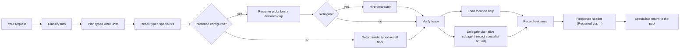
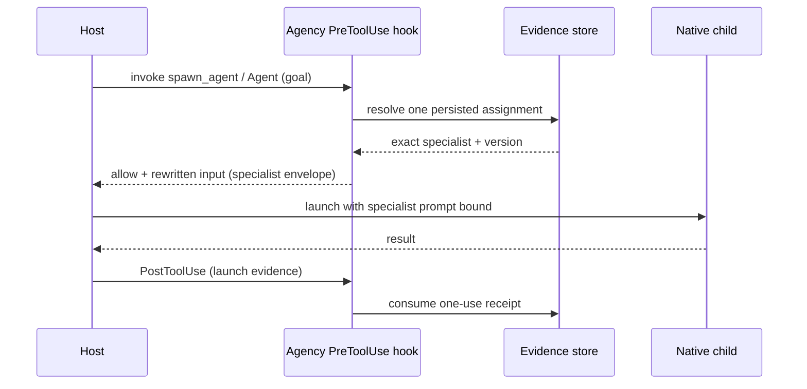

<p align="center">
  
</p>

<h1 align="center">Agency Runtime</h1>

<p align="center">Give your coding agent a bench of 263 audited specialists — without bloating every conversation into a giant prompt.</p>

<p align="center">
  <a href="LICENSE"></a>
  
  
  
  
  
</p>

For each request, Agency Runtime understands the work, searches an audited
roster of specialists, and gives your host (Codex, Claude Code, ZCode, Hermes,
or OpenClaw) a focused delegation plan. The chosen specialist's instructions
apply to that turn or child task and then leave the active context — your main
agent stays small.

**You get:**

- 🔭 **Inference-first selection** — when a provider is configured, an intent
  planner decomposes the ask and a recruiter picks the best eligible specialist
  per work unit (or declares a real gap and hires a contractor).
- 🧮 **Works offline too** — no provider? Agency falls back to a deterministic
  typed-recall floor (a best typed-guess), stamped so it's never mistaken for an
  inference pick. Configure a provider for intent-aware selection.
- 🧬 **Specialists bind into subagents** — when your host spins up a child, the
  exact audited specialist is injected for that one task with a one-use
  activation receipt.
- 🧑‍💼 **Hires contractors on real gaps** — if no specialist fits, Agency
  compiles, audits, and admits a least-privilege contractor in the same turn.
- 📊 **Local dashboard + CLI** — live routing activity, model receipts,
  workforce lifecycle, and on/off controls.
- 🪟 **Windows and Linux**, five native hosts.

> Agency Runtime is prerelease software. Install it from this repository; no
> public package release is claimed yet.

---

## 🎯 Why

A single generalist agent can't be the best at everything, but loading every
specialist's full prompt into every turn balloons context and degrades the
model. Agency Runtime is the middle path: a **company** of narrow audited
specialists that your main agent recruits per turn.

- **Per-turn best-specialist selection** across the whole enabled roster, not a
  fixed prompt.
- **Inference reads intent** — it picks the specialist for *this* ask (e.g. a
  Git-workflow specialist for "design a branching strategy") that keyword
  matching could never find.
- **Gaps hire contractors in-turn** — a real uncovered capability compiles and
  admits a governed contractor immediately.
- **Stays small** — specialist instructions are turn-/task-scoped and return to
  the pool; they don't accumulate in your main agent's context.
- **Honest evidence** — every response carries a stamped header showing what
  loaded, what model ran, and **how the specialist was recruited**.
- **Proves its value** — release requires measured Agency-on vs Agency-off
  outcome lift on the same host and model (tracked, not yet claimed).

---

## 🧒 How it works (ELI5)

Imagine your main agent has a company directory of 263 specialists.

1. You ask the main agent for something.
2. Agency classifies the turn — new task, follow-up, approval, control command,
   or ordinary conversation.
3. It **plans** the work into typed units (no agent names yet).
4. It **recalls** every approved, enabled specialist that could plausibly fit
   (typed contract fields: artifact, lifecycle, domain, stack, capability,
   authority).
5. The **recruiter** (inference, when configured) picks the best eligible
   specialist per unit — or declares a real gap. Offline, a deterministic
   typed-recall floor makes a best typed-guess.
6. If two specialists would conflict, Agency separates their work instead of
   putting both in one prompt.
7. Small focused work loads into the current turn; larger or independent work is
   delegated through the host's native subagent mechanism with the exact
   specialist bound in.
8. Agency records what really loaded, delegated, and the model evidence.
9. The response shows that evidence in a compact header. On the next request,
   specialists return to the pool.

A small permanent coordination pair (Agents Orchestrator + Chief of Staff) stays
resident. They do not replace domain specialists.



---

## 🔌 Supported hosts

| Host | Integration | Native delegation primitive | Specialist injection | Canary |
|---|---|---|---|---|
| **Codex** | Hooks + MCP + controls | `spawn_agent` | Hook envelope (PreToolUse bind → one-use receipt) | ✅ |
| **Claude Code** | Hooks + MCP + controls | `Agent` | Hook envelope (PreToolUse bind → one-use receipt) | ✅ |
| **ZCode** | Hooks + controls | `Agent` (Claude-like) | Hook envelope (PreToolUse bind → one-use receipt) | planned |
| **Hermes** | Python plugin + MCP | `delegate_task` | MCP-plugin context framing | ✅ |
| **OpenClaw** | JavaScript plugin | `sessions_spawn` | MCP-plugin context framing | ✅ |

All hosts have deterministic Windows and Linux contract coverage. **Live status
is reported separately** — a copied plugin directory is never proof a host loaded
it. Run `agency doctor --json` to see what is installed and verified.

> **ZCode note:** ZCode reuses the Claude hook model and `Agent`-tool primitive,
> so it's first-class for main-session routing. ZCode **native children are
> host-limited**: ZCode does not emit `SubagentStart`/`SubagentStop`, so governed
> native-child self-routing can't fire for ZCode children yet (tracked, gated on
> host support). Main-session specialist binding works.

---

## 🧬 How a specialist gets into a subagent

Your host keeps its own scheduler. Agency doesn't replace it — it binds the exact
audited specialist into the child for that one task. There are two mechanisms:

### Hook hosts (Codex, Claude Code, ZCode)

When the host invokes its native delegation tool (`spawn_agent` / `Agent`), a
`PreToolUse` hook resolves the one persisted assignment for that child, verifies
the goal matches the plan, and injects the specialist's exact versioned prompt as
an `[AGENCY EXACT SPECIALIST ACTIVATION v1]` envelope into the child's task
input. After the host proves it executed the launch, a `PostToolUse` hook
**consumes the one-use activation receipt** — it can't be replayed. Payloads are
byte-budgeted (64 KiB) and never silently truncated.



### MCP-plugin hosts (Hermes, OpenClaw)

These hosts deliver the specialist as prompt-context framing through a subprocess
backend (`delegate_task` / `sessions_spawn`), and record child lifecycle via
explicit `native_child_started` / `native_child_ended` bridge actions.

---

## 🧑‍💼 Recruiter, gaps, and contractor hiring

When a provider is configured, selection is inference-first:

1. **Plan** — one compact inference call decomposes the ask into typed work units
   (outcome, artifact, lifecycle, domain, stack, capabilities, authority,
   dependencies).
2. **Recall** — deterministic, zero-false-negative typed recall reduces the whole
   workforce to the plausibly-relevant specialists.
3. **Recruit** — the recruiter (one bounded inference call over the recall
   shortlist) nominates the best eligible specialist per unit — `required`,
   `acceptable`, or `forbidden` — or declares a real gap.
4. **Verify** — deterministic code validates eligibility, composition, coverage,
   and budget around the model's trusted nomination.
5. **Gap → hire** — if no specialist covers a unit, Agency hires a contractor.

### Contractor hiring (`hire_contractor_for_gap`)

A declared gap is a contractor specification. Agency:

- **Compiles** a structured contract through a fixed, security-reviewed prompt
  template (never an unrestricted model-written system prompt).
- **Criticizes** it with an independent hiring-critic inference pass.
- **Risk-tiers** it and runs deterministic Unicode / injection / exfiltration /
  authority / tool / conflict / duplicate checks.
- **Admits** the worker as a least-privilege, visibly-marked probationary
  contractor tied to the agency origin (`origin="agency"`,
  `employment="contractor"`), with a one-use activation receipt.
- High-risk domains still require explicit human approval.

Contractors follow the **same audited, versioned, composition-bound path** as
employees. **Promotion to employee is human-controlled** — an operator must act,
and only after independently-verified successful assignments.

---

## 🧪 What gets routed for an ask

Agency reads the **intent** of the ask and the **detected stack/domain** to
pick specialists — it doesn't keyword-match. The same phrasing routes to a
different specialist depending on the repository context, and a single ask often
decomposes into a multi-specialist team. *(Representative — actual picks depend
on the detected stack and the live roster.)*

**Same ask, different specialists by context:**

| Ask (with context) | Recruited via | Specialist |
|---|---|---|
| "fix the auth bug" — in a Python repo | inference | `python-application-engineer` |
| "fix the auth bug" — in a TypeScript repo | inference | `typescript-application-engineer` |
| "fix the auth bug" — in a Go repo | inference | `go-application-engineer` |

The router reads the repository's stacks, not the literal words.

**One ask → a governed multi-specialist team (sequential units):**

| Ask | Recruited via | Team decomposition |
|---|---|---|
| "Review this code for correctness and security" | inference | `code-reviewer` + `ai-generated-code-security-auditor` |
| "Design a Git branching strategy" | inference | discovery → design → implement → review → test, incl. `git-workflow-master` |
| "Build a FluxUI dashboard" | inference | `senior-developer` (owns FluxUI/Livewire/Laravel) |
| "Investigate and contain this production incident" | inference | discovery → analysis → recovery plan → operations |

**No provider configured?** Agency falls back to a deterministic typed-recall
floor (stamped `Recruited via: deterministic`) — a best typed-guess specialist
rather than nothing. Configure a provider for the intent-aware picks above.

Try it yourself on your own repo:

```bash
agency route "review this authentication design and propose tests"
agency explain "review this authentication design and propose tests"
```

---

## 🤖 Configure inference

Agency works without a provider (deterministic typed-recall floor). Configure one
for intent-aware selection.

```bash
agency configure          # guided setup
agency config show
agency config validate
```

**Ways to configure inference:**

- **Codex CLI / subscription reuse** — reuse an authenticated Codex session;
  exposes the account-visible model and reasoning levels (`low` is usually
  enough for the compact plan and reduces latency).
- **OpenAI-compatible endpoint** — any local or remote OpenAI-compatible API
  (e.g. `http://127.0.0.1:1234/v1`).
- **LiteLLM router** — enter the router/model-group alias exactly (e.g.
  `task-agency-router`).
- **Ordered fallback chain** — providers tried in order; the first healthy one
  serves the turn.

```yaml
providers:
  - name: codex-cli
    type: cli
    transport: codex
    model: ""
    reasoning_effort: low
    timeout: 60
  - name: local-compatible
    type: openai-compatible
    model: local-model
    base_url: http://127.0.0.1:1234/v1
    timeout: 15
```

```bash
agency config provider set codex-subscription --type cli --transport codex --model gpt-5.6-luna --reasoning-effort low --timeout 60
agency config provider set office-router --type litellm --model task-agency-router --base-url http://127.0.0.1:4000/v1
agency config set judge.model qwen3.5:2b
agency config set delegation.child_inference_budget 4
```

If a configured chain is unavailable, Agency reports selection is degraded
rather than pretending deterministic candidates were model-selected.

Default files: config `~/.agency-runtime/agency.yaml`, database
`~/.agency-runtime/agency.db`, global switch `~/.agency-runtime/run/control.json`.
Use `AGENCY_CONFIG_PATH` / `AGENCY_DB_PATH` to relocate.

---

## 📦 Install

Python 3.10+.

```bash
git clone https://github.com/Holeshot-Software-LLC/agency-runtime.git
cd agency-runtime
python -m pip install .

agency --version
agency install --all --dry-run
agency doctor
```

Inspect the exact installed build and resolve an update target without changing
the environment:

```bash
agency -V                                      # fast package version
agency version --json                         # source/VCS commit + install kind
agency upgrade check --channel release        # latest stable release
agency upgrade check --channel main --refresh # current development head
agency upgrade --version 0.2.0                 # exact release plan
agency upgrade --ref <full-commit-sha>         # exact ref plan
```

The repository currently has no published stable release, so the release check
truthfully reports unavailable. Private-repository checks use your configured
GitHub CLI authentication when present; Agency neither stores nor returns that
credential. `--cached` performs no remote access, and
`AGENCY_UPDATE_NOTICES=0` disables interactive cache notices.

`agency upgrade` is deliberately a planner, not a self-modifying installer. It
resolves the selector to one full immutable commit and prints an exact usable
package-install command plus the Codex-refresh command for review in an
owner-controlled terminal; it reports
`mutation_performed=false` and executes neither displayed mutation. The
authenticated dashboard checks stale release/main metadata in the background
and exposes the same fixed copy-only attended command. It cannot install
packages, refresh Codex, restart itself, or bypass Windows operator presence. See
[ADR-0107](docs/decisions/0107-resolve-updates-immutably-and-keep-application-attended.md).

The plan uses the current interpreter only after proving the Agency package and
regular `pip` entry point are inside that exact private, non-repository
environment and a bounded isolated `pip --version` probe succeeds. A uv-managed
Agency tool normally omits pip, so Agency instead requires the bounded uv
receipt to identify this exact tool environment and a non-repository `uv`
executable. Bounded `uv tool dir --no-config` probes must then prove that uv's
default tool and executable directories own the current prefix and receipt
entry point. Target-changing uv/XDG environment overrides fail closed. The
planner then emits `uv tool install --force --refresh --no-config` against the
same commit-pinned source. Run the displayed commands unchanged in the same
owner-controlled environment; regenerate the plan after any environment
change. Windows displays are inert PowerShell invocations, and POSIX uv
entrypoint symlinks must resolve inside the exact tool prefix. If neither
installer can be proven usable, planning fails closed rather than printing a
command that cannot run.

This unreleased source keeps persistent setup and control mutations fail-closed
unless one bounded entry point satisfies its native operator-presence and
operation-specific preconditions. Exact
`agency roster rollback` prepares and revalidates one authoritative Store
transition. Exact `agency install --agent codex --no-dashboard` refreshes an
already managed, registered, and enabled Codex marketplace; it does not create
a missing installation. The ownership-bound host uninstall described below is
a separate attended mutation. These paths invoke the packaged native Windows
consent window and consume its result only in the initiating call stack. Every
other positive `configure`, `install`, service, host, agent, and retention
mutation remains unavailable. Do not substitute a static confirmation, bearer
token, environment variable, or model-callable credential for genuine operator
presence. See
[AR-143](docs/roadmap/issue-AR-143-require-operator-presence-for-controls.md).

That native slice is not yet a production distribution claim. The source now
derives a portable `py3-none-any` profile on non-Windows-x64 hosts and a
`py3-none-win_amd64` profile on supported Windows x64. The portable wheel keeps
the native source, provenance, and notices for review but excludes only the PE.
Each producer emits one wheel/source pair; the merge gate requires identical
source distributions and shared wheel payloads before independently verifying
the assembled two-wheel-plus-sdist unsigned review set. Hosted cross-OS proof remains
pending because repository Actions billing is disabled. The helper is also
unsigned: ADR-0099 keeps deterministic review bytes separate from
owner-authorized signed delivery. AR-160 and AR-161 remain release gates,
including hosted proof, compiler/runtime/SDK legal review, and an attended
Windows Hello canary. Install from this repository only as prerelease source;
no signed public artifact exists.

The Codex refresh path freezes the configuration, database and generation
identities, current target tree, candidate transaction plan, launcher, Codex
executable and environment, and exact native inventory before asking for
Windows Hello. Under the shared private host-integrations lock it re-prepares,
atomically swaps the marketplace tree, removes and re-adds the native plugin,
and proves the published tree and inventory. A bounded compensation path
restores the prior tree and registration when a post-publication check fails. A
process crash can still require recovery from the retained backup, so this is not yet the general
fresh-host installer contract.

**Codex** will also require you to approve command hooks. Agency installs the
plugin, reports `activation_required`, and gives the exact next step. To refresh
an existing managed Codex adapter from this source, first run:

```bash
agency install --agent codex --no-dashboard
```

That transaction deliberately does not claim activation. Close every Codex
terminal TUI opened before the install or refresh, then run `codex` in a fresh
terminal. Choose **Trust all and continue** when the startup review lists all
eight Agency events, or run `/hooks` inside that fresh terminal TUI. Start a new
session so the settled plugin can load, then run:

```bash
agency install --agent codex --verify-activation
```

Verification first asks Codex for the read-only hook inventory. It starts the
bounded model-backed canary only when the exact eight Agency hooks are enabled
and trusted; missing, changed, or unsettled trust fails quickly without using
provider quota.

The intended post-gate install and rollback commands include ZCode:

```bash
agency install --agent zcode
agency install --agent codex --rollback
```

When positive installation is enabled, the dashboard installs by default as a
per-user service (no admin access). `agency install --all --no-dashboard` omits
it. Managed files and backups live under `~/.agency-runtime/`.

Remove only Agency's native host integrations with a reviewed two-step plan:

```bash
agency uninstall --all --dry-run --json
agency uninstall --all --confirm-plan <plan_digest> --json

# Or scope both calls to one host:
agency uninstall --agent codex --dry-run --json
agency uninstall --agent codex --confirm-plan <plan_digest> --json
```

Application recomputes the exact plan, so a changed selector, host, managed tree
or parent, install identity, prepared launcher or any executable/wrapper
artifact in its process chain, host profile environment, native plugin or
marketplace source, gateway/ZCode state, or command plan invalidates the digest.
Native provenance accepts only documented path aliases; an invalid, relative,
or conflicting alias blocks even if another alias points at the
managed target. A mutating plan then opens the native Windows confirmation action
`uninstall.host-integrations.v1`. That prompt is bound to one operation UUID,
the canonical hosts and transitions, outer plan and per-host binding hashes,
the exact retained destinations, and fixed preservation/recovery policies; it
is not a generic installation approval.

Generic mutating install, rollback, native enable/disable toggle,
prepared Codex refresh, and host uninstall share one owner-private
`host-integrations.lock`. After Windows authority, uninstall acquires that lock,
revalidates its full binding, and records intent before the first host mutation;
denial writes no journal and every later host skipped after a failure is reported
as `not_attempted`. Only a strict ownership-proven adapter tree is moved after
native detachment is proven, to the exact destination
`~/.agency-runtime/backups/<host>/uninstall-<operation_uuid>`. Windows follows
the validated directory through an open handle during rename, so a pathname
swap cannot redirect retirement. Restore that exact bundle with the result's
`agency install --rollback --agent <host> --backup <retained_path>` command.
On Windows, copy the reported command exactly: it starts with PowerShell's `&`
and single-quotes every argument so path metacharacters remain literal.
There is no purge option: the Python package, Agency Runtime configuration,
Store, roster, evidence, existing backups, and dashboard service are preserved.
Exact plugin registration or Agency-owned
ZCode handlers necessarily change; unrelated host configuration is preserved.
This command does not call the dashboard-service uninstaller. Codex and Claude
marketplace registrations are also retained as user configuration unless a
future install ledger proves Agency created an exact entry exclusively;
marketplace-only residue does not select a host under `--all`, while an
ambiguous or mismatched marketplace blocks an otherwise selected integration
without being removed. The dashboard may copy the write-free preview command,
but it has no uninstall mutation endpoint. Hermes may retain its exact Agency
inventory row in a proven disabled state; that is its detachment contract, not a
claim that the row was deleted. ZCode performs two unchanged-byte checks before
atomic replacement under the Agency lock, but an external same-account ZCode
writer can still race between the final read and replacement; this is not
claimed as filesystem compare-and-swap. Restart affected hosts before treating
Agency as unloaded from already-running sessions. See
[AR-189](docs/roadmap/issue-AR-189-add-owned-host-integration-uninstall.md) and
[ADR-0108](docs/decisions/0108-retire-only-owned-host-integrations.md).

---

## 🛠 Everyday commands

```bash
agency status                 # system + host status
agency doctor --json          # what's installed and verified
agency smoke --all --json     # canary readiness check (see 🩺 below)
agency agents list            # roster
agency roster list

agency search "incident response"
agency route "review this authentication design"
agency explain "review this authentication design" --session-id demo
agency eval routing --json --no-details
```

Inspect the persistent host and global states without changing them:

```bash
agency status --agent codex
agency status
agency off --agent codex --dry-run --json
```

The data contracts retain reversible host, global, and per-agent controls, but
positive CLI mutations other than the exact prerelease Windows 11 x64 roster
rollback, existing-Codex refresh, and ownership-bound host uninstall remain
unavailable until AR-143 is complete. The dashboard and every model-facing
surface are read-only. The native rollback is not production-ready until AR-160
and AR-161 close. `agents-orchestrator` and `chief-of-staff` remain
the protected coordination pair.

---

## 📊 Operations dashboard

The optional local dashboard shows live routing, delegation, provider health,
model receipts, host status, roster and workforce evidence, recent turns, and
cached/background update status.
It is a local-only, bounded, read-only observability surface; every former
mutation endpoint rejects both owner and broker bearers. See
[ADR-0096](docs/decisions/0096-require-operator-presence-for-persistent-controls.md).

---

## 🔍 Response header

Every Agency response starts with an evidence header — a truth-receipt, not
marketing:

```text
Agency/Agencies loaded: code-reviewer
Agency/Agencies delegated: none
Skills loaded: none
Actual Model selected: gpt-5.6-luna -> codex/gpt-5.6-luna
Recruited via: inference
Why: Security review requested for auth code
How it shaped outcome: Loaded code review + security auditor
```

The **`Recruited via`** line is machine-stamped (`inference`, `deterministic`,
`cached`, or `none`) — distinct from the model-authored `Why`. It tells you at a
glance how the specialist was actually selected, including when the offline
typed-recall floor fired.

---

## 📂 Roster & the upstream project

Agency Runtime ships a **263-specialist audited roster** sourced from an
upstream open-source specialist-pool project (MIT, pinned revision). Credit and
thanks to that project — the audited pool of specialists is the upstream asset
worth borrowing. (Provenance — repository, exact revision, and license — is
recorded in the bundled roster manifest and in [LICENSE](LICENSE).)

- The roster is the community-sync asset, **not** a selector. Agency Runtime uses
  its own inference-first router; it does not vendor the upstream selector.
- Pull in deltas: `agency source add <path> --name ...` then
  `agency roster upstream import --source-revision <rev>`. **Import only
  quarantines the delta** — it never approves or activates.
- New agents become selectable only after a separate **audit → approval →
  activation** step, so nothing enters the live roster unreviewed.
- A nightly workflow runs the upstream delta audit and publishes review evidence.
- Enrichment (`scripts/enrich_workforce_contracts.py`) regenerates typed
  `stacks`/`domains` and user-facing `scope_qualifiers` for the roster so the
  deterministic verifier scores real stack coverage.

---

## 🔐 Privacy and security

Agency runs locally; the dashboard is local-only. Specialist prompts are
turn-/task-scoped and don't accumulate. See
[SECURITY.md](SECURITY.md) and [docs/THREAT_MODEL.md](docs/THREAT_MODEL.md) for
vulnerability reporting, trust boundaries, and enforced controls.

---

## 🩺 Canaries

A **canary** is an isolated, non-mutating readiness smoke that proves the
*installed* runtime actually fires end-to-end on a real host. Tests run in pytest
with stubs; a canary catches what tests can't — a broken hook registration, a
wrong config path, or a provider that times out. It refuses to claim success
without explicit confirmation before any live backend call.

```bash
agency smoke --agent codex --json
agency smoke --all --json
```

---

## 🧯 Troubleshooting & development

- [docs/TROUBLESHOOTING.md](docs/TROUBLESHOOTING.md) — host maturity, MCP,
  LiteLLM, dashboard, and platform diagnostics.
- [CONTRIBUTING.md](CONTRIBUTING.md) — setup, implementation boundaries,
  validation.
- [docs/RELEASE_CHECKLIST.md](docs/RELEASE_CHECKLIST.md) — release gates.

## License

[MIT](LICENSE). Roster specialists are sourced under MIT from the upstream
specialist-pool project. Native Windows source provenance, C++/WinRT MIT text,
Microsoft STL Apache-2.0 WITH LLVM-exception text and NOTICE, and the unresolved
MSVC/Windows SDK/static-runtime legal gate are recorded in
[THIRD_PARTY_NOTICES.md](THIRD_PARTY_NOTICES.md).
