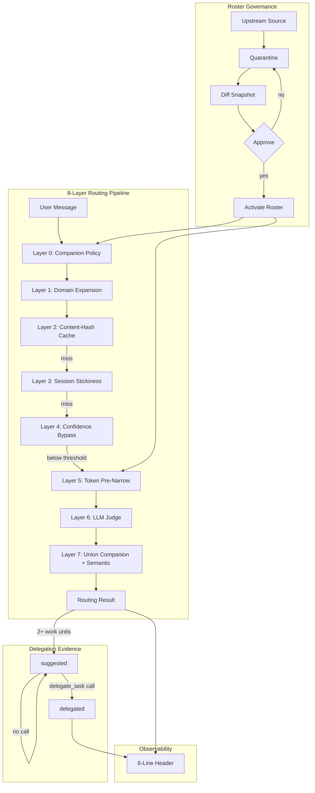
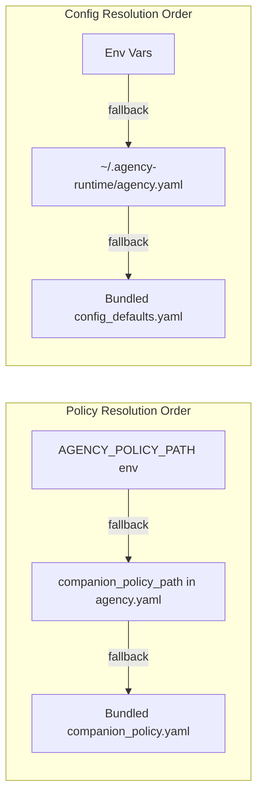
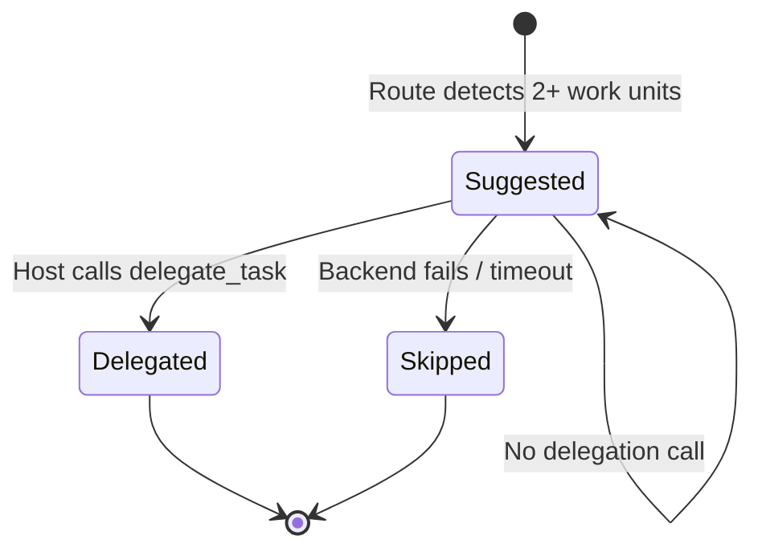

<div align="center">

# Agency Runtime

**A portable control plane for AI-agent specialist routing, delegation evidence, roster governance, and model/run observability.**

[](https://opensource.org/licenses/MIT)
[](https://www.python.org/downloads/)
[](#testing)

</div>

---

## Architecture at a Glance





## Thank You: agency-agents

Agency Runtime exists because [msitarzewski/agency-agents](https://github.com/msitarzewski/agency-agents) made a high-quality open specialist-agent roster available to the community.

That project is the inspiration and the default upstream roster source. Agency Runtime is intentionally complementary: it does **not** replace `agency-agents`; it gives AI-agent hosts a portable runtime that can import, quarantine, diff, activate, route, delegate, and audit specialist rosters such as `agency-agents`.

## Why This Exists

Every AI-agent framework eventually hits the same operational wall: the agent can call tools, but it cannot reliably prove which specialist it consulted, which work it delegated, which model actually ran, or why a routing decision happened.

Agency Runtime makes those decisions visible and durable:

1. **Specialist Routing** - an 8-layer pipeline matches tasks to the right specialist from your active roster.
2. **Delegation Accountability** - independent work units are persisted as `suggested`, then promoted to `delegated` only when a host actually calls a delegation tool.
3. **Model Receipts** - every host adapter can record the resolved model from runtime telemetry, including honest `unavailable` receipts when a host emits no model truth.
4. **Observability Headers** - responses start with a six-line header showing loaded specialists, delegated specialists, loaded skills, actual model, and outcome rationale.
5. **Roster Governance** - upstream agent rosters flow through quarantine, diff, approval, and activation before they affect routing.

## Agency Runtime vs agency-agents

| Project | What it is | What it owns |
|---|---|---|
| [`agency-agents`](https://github.com/msitarzewski/agency-agents) | Open specialist-agent roster and prompt ecosystem | Agent definitions, names, roles, specialist prompts, upstream community roster |
| `agency-runtime` | Portable runtime/control plane | Host adapters, SQLite state, routing, delegation evidence, model receipts, roster import/governance, CLI/server surfaces |

Use them together:

```bash
agency source add /path/to/agency-agents/integrations/hermes/agency-agents-router/data/agents.json --name agency-agents
agency sync --review
agency roster approve <snapshot-id>
agency roster activate <snapshot-id>
```

## Install

### From GitHub

```bash
python -m pip install "agency-runtime @ git+https://github.com/<owner>/agency-runtime.git"
agency configure --non-interactive --profile standard
agency install --all
agency doctor
agency smoke --all
```

### From a Local Clone

```bash
git clone https://github.com/<owner>/agency-runtime.git
cd agency-runtime
python -m pip install -e ".[dev]"
python -m pytest tests/ -q
agency configure --non-interactive --profile standard
agency install --all
agency doctor
agency smoke --all
```

### Paste-Into-An-Agent Prompt

Use this prompt in Codex, Claude Code, Hermes, OpenClaw/Nexus, or another coding agent:

```text
Install Agency Runtime from https://github.com/<owner>/agency-runtime.
Use the repo README as source of truth. Install it in editable mode if working from a clone, run `agency configure --non-interactive --profile standard`, then run `agency install --all`, `agency doctor`, `agency smoke --all`, `agency eval delegation --json`, and `agency route "review this PR for security issues"`.
If the package is already cloned locally, do not reclone it; update/install from that working tree. Preserve existing config and do not delete roster data. Report the exact plugin paths wired, test results, and any host that was not detected.
```

## Setup Modes

### Auto-Detect Every Host

```bash
agency install --all
```

Scans for supported hosts and writes thin plugin files that import from the installed `agency_runtime` package. No host gets vendored code.

### Single Host

```bash
agency install --agent hermes
agency install --agent openclaw
agency install --agent codex
agency install --agent claude
```

### Standalone CLI/Library

```bash
agency install
agency route "review this PR for security issues"
agency search "SRE incident"
agency route "review this PR"     # now shows companion actions + ids
agency policy                      # validate all 16 broad actions against roster
agency policy --json               # machine-readable coverage report
```

This seeds the starter roster and leaves host plugin wiring untouched.

### Enable / Disable Host Wiring

```bash
agency off --agent hermes
agency on --agent hermes
```

Disable renames the generated plugin to `__init__.py.disabled`; it does not delete SQLite state.

## Supported Hosts

| Host | Runtime surface | Evidence support |
|---|---|---|
| Hermes Agent | `~/.hermes-nexus/plugins/agency-preflight/` | Preflight, pre-verify, post-tool evidence, model receipts, response finalization |
| OpenClaw / Nexus | `~/.openclaw/agency-preflight/` | Typed hook parity, post-tool evidence, model receipts, response finalization |
| Codex | `~/.codex/agency-preflight/` plus `codex exec` backend | Generated hook plugin, CLI delegation backend, tool evidence, model receipts |
| Claude Code | `~/.claude/agency-preflight/` plus `claude` backend | Generated hook plugin, CLI delegation backend, tool evidence, model receipts |
| Generic CLI | `agency_runtime.adapters.generic.wrapper.GenericAdapter` | Generic command backend, tool evidence, model receipts |

Generated plugins are smoke-tested by importing the written plugin, registering hooks, and exercising `pre_llm_call`, `pre_verify`, `post_tool_call`, `post_api_request`, and `transform_llm_output`.

## Configuration

`agency configure` writes `~/.agency-runtime/agency.yaml` and stores runtime state in `~/.agency-runtime/agency.db` by default.

```bash
agency configure                    # guided setup
agency configure --non-interactive  # detected defaults
agency config show                  # redacted effective config
agency config validate              # config + provider reachability checks
agency config path                  # config location
```

Environment overrides:

| Variable | Purpose |
|---|---|
| `AGENCY_CONFIG_PATH` | Config file location |
| `AGENCY_DB_PATH` | SQLite database path |
| `AGENCY_JUDGE_MODEL` | Specialist-routing judge model |
| `AGENCY_JUDGE_BASE_URL` | Judge endpoint URL |
| `AGENCY_JUDGE_API_KEY` | Judge API key |
| `AGENCY_JUDGE_TIMEOUT` | Judge timeout in seconds |
| `AGENCY_MAX_SELECTED` | Max specialists per task |
| `AGENCY_BYPASS_THRESHOLD` | Token-score threshold before skipping the LLM judge |
| `LITELLM_API_KEY` | LiteLLM proxy key |
| `OPENAI_API_KEY` | OpenAI-compatible provider key |
| `ANTHROPIC_API_KEY` | Anthropic provider key |
| `OLLAMA_BASE_URL` | Ollama endpoint |

Profiles:

```bash
agency configure --profile local-only   # local/free-first, no network sync
agency configure --profile standard     # default detected providers, manual roster activation
agency configure --profile power        # power-user defaults, still approval-gated
agency configure --profile yolo         # trusted-source nightly automation mode
```

## Roster Sync Job

Agency Runtime's built-in roster sync job is `agency sync`. It is intentionally approval-gated:

```bash
agency source add /path/to/agency-agents/integrations/hermes/agency-agents-router/data/agents.json --name agency-agents
agency sync --dry-run                  # fetch + validate without writing candidates
agency sync --review                   # quarantine candidates and show snapshot diff
agency roster approve <snapshot-id>    # approve the generated snapshot
agency roster activate <snapshot-id>   # activate approved agents for routing
agency roster list
```

For trusted automation, use:

```bash
agency source add /path/to/agents.json --name agency-agents --trusted-for-auto-approve
agency sync --auto-approve
```

`--auto-approve` fails closed unless every enabled source is explicitly marked `--trusted-for-auto-approve`, every source fetches and validates successfully, and at least one candidate is quarantined. Use a raw JSON/YAML/Markdown file, a local directory, or a generated `agents.json`; regular GitHub repository pages are HTML and are rejected.

The sync pipeline is:

1. **Source** - registered with `agency source add`.
2. **Download** - agent files are fetched and hashed.
3. **Quarantine** - candidates are normalized and validated before activation.
4. **Diff** - `added`, `changed`, `removed`, and `unchanged` are captured in a snapshot.
5. **Approve** - an operator or trusted job approves the snapshot.
6. **Activate** - active roster rows are replaced from the approved snapshot.
7. **Audit** - import events, snapshots, active agents, and versions remain in SQLite.

No sync path silently enables arbitrary upstream agents unless you explicitly run `--auto-approve` or approve/activate the snapshot. `agency install` seeds bundled starter agents only when those slugs are missing, so reinstalling host plugins does not downgrade agents that were already activated from a trusted synced roster.

## How Routing Works

```text
User Message
  -> Layer 0: companion policy for deterministic action-to-agent matches
  -> Layer 1: domain expansion
  -> Layer 2: content-hash cache
  -> Layer 3: session stickiness
  -> Layer 4: confidence bypass for strong token matches
  -> Layer 5: token pre-narrowing
  -> Layer 6: LLM judge with provider fallback
  -> Layer 7: union companion + semantic results
  -> Routing Result: selected_ids, confidence, status, work_units
```

Even without a working LLM provider, routing falls back to token scoring so the agent gets a deterministic result instead of a silent failure.

### Current Companion Policy Coverage

Layer 0 loads deterministic companions from `AGENCY_POLICY_PATH`, then `companion_policy_path` in `agency.yaml`, then the bundled fallback. The full policy used by the current runtime configuration is the broad-action matrix below.

Current verification against the active roster shows:

- All `always_include` specialists in the matrix are present in the active roster.
- The full policy references 16 broad actions and 238 unique specialist slugs.
- Three conditional entries are configured but not currently active in the roster: `internationalization-engineer`, `payments-billing-engineer`, and `test-automation-engineer`.
- `agency route` is a token-ranked CLI helper that now also displays Layer 0 companion actions and ids; use `agency explain` or `agency policy` for full selector/policy inspection.

| Broad action | Always include | Conditional coverage |
|---|---|---|
| `CODING` | `code-reviewer`, `reality-checker`, `senior-developer` | AppSec, codebase onboarding, minimal-change, prompt/API/LSP/git specialists, CMS/e-commerce, embedded/mobile, Solidity, voice AI, Feishu/WeChat, and other engineering niches. Roster gaps: `internationalization-engineer`, `payments-billing-engineer`. |
| `PERFORMANCE` | `performance-benchmarker`, `autonomous-optimization-architect` | Database optimization, codebase onboarding, architecture, senior implementation, and test automation. Roster gap: `test-automation-engineer`. |
| `GITHUB_WRITE` | `technical-writer`, `git-workflow-master`, `code-reviewer` | Jira-linked Git workflow stewardship. |
| `ARCHITECTURE` | `software-architect`, `workflow-architect` | Multi-agent systems, backend/API architecture, rapid prototyping, i18n, and payments architecture. Roster gaps: `internationalization-engineer`, `payments-billing-engineer`. |
| `ORCHESTRATION` | `agents-orchestrator`, `workflow-architect`, `chief-of-staff` | Product/project management, project shepherding, infrastructure maintenance, automation governance, and multi-agent systems. |
| `DEBUGGING` | `codebase-onboarding-engineer`, `code-reviewer` | Incident command, SRE, SecOps, and reality-check verification. |
| `DEVOPS_INFRA` | `devops-automator`, `infrastructure-maintainer` | SRE, network engineering, IT service management, support response, i18n, and payments. Roster gaps: `internationalization-engineer`, `payments-billing-engineer`. |
| `IDEATION` | `trend-researcher`, `developer-advocate`, `product-manager` | Sprint prioritization, business strategy, growth, feedback synthesis, and behavioral nudging. |
| `DOCUMENTATION` | `technical-writer` | Document generation, Zettelkasten/knowledge-base stewardship, and grant writing. |
| `SECURITY` | `application-security-engineer`, `security-architect` | Pen testing, compliance, SecOps, cloud security, threat intel, incident response, blockchain security, privacy, and detection engineering. |
| `TESTING_QA` | `reality-checker`, `evidence-collector` | Performance/API/accessibility testing, result analysis, tool evaluation, workflow optimization, model QA, and test automation. Roster gap: `test-automation-engineer`. |
| `UI_UX` | `ui-designer`, `ux-architect` | UX research, frontend implementation, visual storytelling, brand, whimsy, persona walkthroughs, inclusive visuals, accessibility, and image prompting. |
| `DATA_ML` | `ai-engineer`, `data-engineer` | Autonomous optimization, model QA, analytics reporting, prompt engineering, and AI data remediation. |
| `BUSINESS` | `business-strategist`, `financial-analyst` | Finance, sales, marketing, legal, compliance, content, social, paid media, China market, and growth specialists. |
| `PROJECT_MGMT` | `senior-project-manager`, `project-shepherd` | Product management, studio production/operations, experiment tracking, meeting notes, and operations management. |
| `DEFAULT` | `agents-orchestrator`, `chief-of-staff` | Executive summaries, strategy duel, business strategy, game-development, GIS, spatial, and other specialized fallback coverage. |

### Explain Routing Decisions

Use `agency explain` or `POST /explain` when an operator needs to debug why a specialist was selected:

```bash
agency explain "review this PR for security issues" --session-id session-1 --limit 10
curl -s http://127.0.0.1:7800/explain \
  -H 'Content-Type: application/json' \
  -d '{"session_id":"session-1","task":"review this PR for security issues","limit":10}'
```

The JSON receipt is stable under `schema_version="agency.selection_explain.v1"` and includes selected specialists, considered candidates, rejected-candidate reasons, policy hits, domain expansion, cache/stickiness state, selection status, and work-unit evidence. The MCP surface exposes the same receipt as `agency.explain_selection`.

## Delegation Evidence

When the selector detects multiple independent work units, Agency Runtime writes `delegation_events` rows with `status='suggested'`. Host tool calls then promote those rows:

| Host tool | Event transition | Header effect |
|---|---|---|
| `delegate_task` / `delegate_async` | `suggested -> delegated` | `Agency/Agencies delegated: <agent> via delegate_task` |
| `agency_agents_delegate` | `suggested -> delegated` when nested `delegate_task` succeeds; `suggested -> skipped` with `skip_reason` when the host delegate backend fails | delegated specialist or explicit blocker |
| no delegation tool call | remains `suggested` | pre-verify rejects bare `Agency/Agencies delegated: none` |
| explicit blocker | remains `suggested` with a non-bare reason in the header | accepted as surfaced evidence |

This is the contract: detection alone is not delegation. A passing run must align preflight context, SQLite delegation events, the final header, and pre-verify behavior.



## Observability Header

Every enabled host can finalize responses into this shape:

```text
Agency/Agencies loaded: security-architect, code-reviewer
Agency/Agencies delegated: security-architect via delegate_task
Skills loaded: github-code-review
Actual Model selected: task-implementation -> anthropic/claude-3-5-sonnet
Why: Security review requires threat modeling expertise
How it shaped outcome: Identified injection vectors in auth middleware
```

Important distinction: skills are not Agency roster agents. For example, `agent-reach` is reported under `Skills loaded`, never under `Agency/Agencies loaded`.

## Model Receipts

The `Actual Model selected` line is populated from runtime receipts, not from a requested alias. If a LiteLLM group or host fallback resolves `task-implementation` to another model, Agency Runtime stores the resolved provider/model. If a host emits no model telemetry, the receipt records `resolved_model='unavailable'` instead of inventing a value.

```sql
SELECT requested_model, resolved_provider, resolved_model, status
FROM model_receipts
WHERE session_id = '...'
ORDER BY ended_at DESC;
```

## SQLite Maintenance

Runtime tables are append-only by design. Keep the DB bounded with:

```bash
agency db stats
agency db trim --older-than-days 30 --dry-run
agency db trim --older-than-days 30
agency db trim --keep-last 1000 --no-vacuum
```

Trim only touches runtime/audit tables (`runs`, `model_receipts`, `skills_loaded`, `specialists_loaded`, `delegation_events`, `worker_runs`, `finalization_events`). Roster sources, candidates, snapshots, versions, and active agents are preserved.

## CLI Reference

```bash
# Setup / health
agency configure
agency install [--all|--agent NAME]
agency on [--agent NAME]
agency off [--agent NAME]
agency doctor [--json]
agency smoke [--all] [--json]

# Config
agency config show
agency config set judge.model <model>
agency config validate
agency config path

# Roster
agency source add <url> [--name NAME] [--trusted-for-auto-approve]
agency source list
agency sync [--dry-run|--review|--auto-approve]
agency roster list
agency roster diff --json
agency roster approve <snapshot-id>
agency roster activate <snapshot-id>
agency search "security"
agency route "review this PR"
agency explain "review this PR" --session-id session-1 --limit 10

# Evidence / maintenance
agency eval delegation --json
agency smoke --all --json
agency db stats --json
agency db trim --older-than-days 30 --json

# Servers / adapters
agency serve
agency delegate --backend codex --agent code-reviewer --task "review this diff" --timeout 30 --json
agency codex exec --help
```

## Python API

```python
from agency_runtime.core.selector.pipeline import route
from agency_runtime.core.store.sqlite import Store

store = Store()
result = route(
    session_id="session-1",
    user_message="Review this PR for security issues",
    catalog=store.get_active_roster_as_catalog(),
)
print(result["selected_ids"])
print(result["work_units"])
```

## Architecture

```text
agency_runtime/
  core/
    config.py              # agency.yaml loader, provider entries, env overrides
    doctor.py              # health checks
    installer.py           # host detection, plugin writing, on/off toggle
    store/sqlite.py        # canonical SQLite store
    selector/              # routing pipeline, cache, stickiness, judge, policy
    header/                # six-line header parsing/fill/finalization
    receipts/              # host + LiteLLM receipt normalization
    delegation/            # lifecycle, backends, events, ledger
    evals/                 # deterministic runtime evals
  adapters/
    base.py                # shared host adapter contract
    hermes/plugin.py       # Hermes adapter
    openclaw/plugin.py     # OpenClaw/Nexus adapter
    codex/wrapper.py       # Codex wrapper/backend
    claude/wrapper.py      # Claude wrapper/backend
    generic/wrapper.py     # generic CLI adapter
    litellm/callback.py    # LiteLLM callback adapter
  cli/main.py              # agency CLI
  server/http.py           # REST API
  server/mcp.py            # MCP server
```

## Testing

```bash
python -m pytest tests/ -q
python -m pytest tests/test_delegation_enforcement.py tests/test_adapter_parity.py -q
agency eval delegation --json
agency smoke --all --json
```

Coverage includes config parsing, provider fallback, roster sync, routing, header validation/finalization, model receipts, delegation lifecycle, all-host adapter evidence parity, generated plugin imports, deterministic smoke checks, SQLite trimming, doctor checks, and HTTP server endpoints.

## Contributing

1. Keep host adapters thin; shared behavior belongs in `BaseAdapter` or `core/`.
2. Add tests for every behavior change.
3. Run `python -m pytest tests/ -q` before opening a PR.
4. Do not commit credentials, provider keys, or private host paths.
5. Keep generated code indexes local: `.codegraph/`, `.chunkhound/`, `.graphify/`, and `graphify-out/` should be regenerated on demand, not committed.
6. Preserve attribution for upstream roster sources such as `agency-agents`.

## Requirements

- Python 3.10+
- SQLite3 from the Python standard library
- `pyyaml`
- Optional: Ollama for local routing fallback
- Optional: host CLIs such as `codex`, `claude`, `hermes`, or OpenClaw/Nexus

## License

MIT - see [LICENSE](LICENSE). Compatible with [agency-agents](https://github.com/msitarzewski/agency-agents), also MIT.

## Related Projects

- [agency-agents](https://github.com/msitarzewski/agency-agents) - open-source specialist agent roster and prompt ecosystem
- [LiteLLM](https://github.com/BerriAI/litellm) - multi-provider LLM proxy
- [Ollama](https://ollama.ai) - local LLM inference
