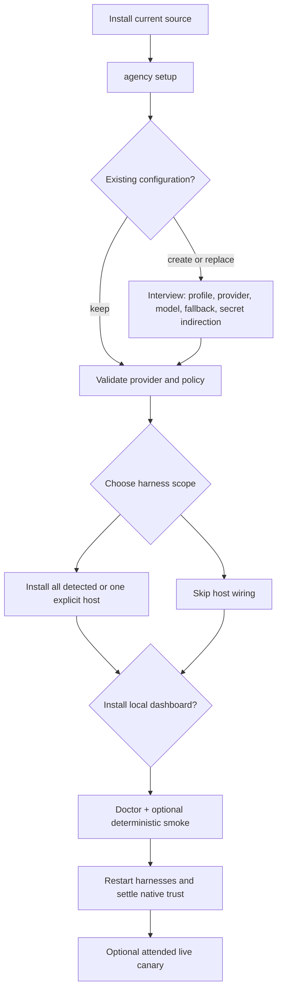
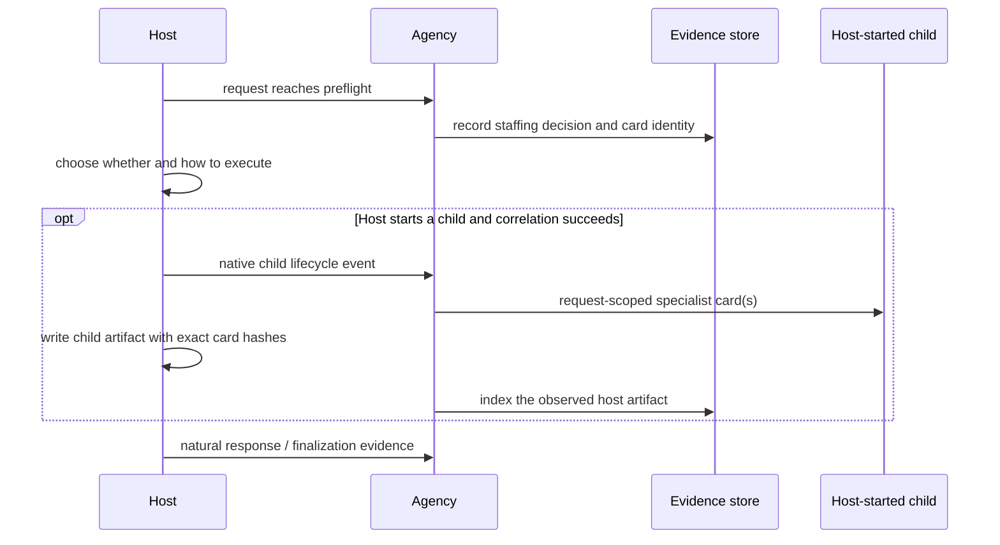

<p align="center">
  
</p>

<h1 align="center">Agency Runtime</h1>

<p align="center">Give your coding agent a bench of 263 audited specialists — without bloating every conversation into a giant prompt.</p>

<p align="center">
  <a href="LICENSE"></a>
  
  
  
  
  
</p>

For each request, Agency Runtime uses inference to decompose the staffing need
and identify the expertise an exacting owner would want from an unlimited
specialist pool. It then selects faithful audited specialists or, for a real
gap, designs, audits, and hires a narrow contractor. This is a staffing
decision, not an execution plan: the native host alone decides whether to
spawn children, what they do, and how it completes the request. When a host
does start a child, Agency's supported integrations are designed to attach
request-scoped specialist cards and correlate the host's own evidence. Only a
host-written artifact containing the exact delivered card hashes before the
child's first speech proves that delivery. The cards leave the active context
with the request, so your main agent stays small.

> **Doctrine note (2026-08-05).** Earlier revisions treated any near-match as
> a mandatory gap and let deterministic coverage checks veto inference-chosen
> teams. In practice that made refusal the default outcome: the models picked
> the right specialists and the machinery abstained. The doctrine is now
> staff-first — deterministic verification annotates the receipt (coverage
> limits, missing independent assurance) instead of vetoing a staffed team,
> and only the safety screens (injection, authority escalation, high-risk
> hiring approval) hard-block.

**You get:**

- 🔭 **Inference-owned staffing** — inference decomposes the ask into bounded
  staffing needs, defines the ideal expertise from an open-ended role pool, and
  then either reuses a faithful roster match or declares a real gap. It does
  not tell the host what child tasks to create or in which order to run them.
- 🚨 **Fails honestly, never locks you out** — deterministic code can recall and
  validate candidates, but it never chooses a specialist. A substantive turn
  without a valid inference decision selects nobody, reports the exact cause
  (recruiter abstention, safety rejection, provider failure), and lets the host
  answer as a generalist with a `Recruited via: none` header rather than
  blocking you out of the agent.
- 🧬 **Request-scoped specialist cards** — when a supported host starts a
  child, Agency can bind audited specialist cards to that host-owned child for
  the request and record the resulting host-written evidence.
- 🧑‍💼 **Hires contractors on real gaps** — if no specialist fits, Agency
  compiles, audits, and admits a least-privilege task specialist in the same
  turn; it does not stretch a near-match into a generalist.
- 📊 **Local dashboard + CLI** — staffing decisions, model receipts,
  workforce lifecycle, bounded delegation-event rows, and owner controls.
- 🪟 **Windows and Linux**, five native hosts.

> Agency Runtime is prerelease software. Install it from this repository; no
> public package release is claimed yet.

## 🚀 Start here

Install the current source with Python 3.10 or newer, then let the guided setup
compose the existing guarded configuration, installation, diagnostic, and
smoke commands:

```bash
git clone https://github.com/Holeshot-Software-LLC/agency-runtime.git
cd agency-runtime
python -m pip install .

agency setup
```

`agency setup` keeps a valid existing configuration by default. On a first
run it opens the provider wizard, validates the result, finds supported agent
harnesses, asks which integrations and optional local dashboard to install,
runs `agency doctor`, and offers deterministic smoke checks. It prints every
stage separately, so a partial install is visible and the same command can be
used to resume. For explicit automation, use a bounded scope such as
`agency setup --non-interactive --all`; non-interactive setup refuses to infer
an installation scope.

Setup exits `0` when every selected stage is complete, `2` when configuration
and installation are usable but an attended action such as Codex hook trust or
a harness restart remains, and `1` on a hard failure. An exit of `2` is a
truthful resumable state, not release or live-host proof; follow the printed
action and rerun setup or the named verification command.



| Setup stage | What you decide | What a passing stage proves |
|---|---|---|
| Inference | Security profile, primary provider/model, credential environment variable, fallback order | The persisted configuration is valid and the selected provider contract is reachable |
| Harnesses | All safely detected hosts, one explicit host, or none | Agency-owned integration files and native registration were applied for the selected scope |
| Dashboard | Install the optional per-user loopback service or skip it | The local service can be installed and opened; it does not prove a host loaded Agency |
| Verification | Doctor and deterministic smoke now or later | Configuration and plugin readiness only; live child execution and card delivery need separate host evidence |

If you installed the dashboard, open it with:

```bash
agency dashboard service open
```

### Current prerelease state

| Surface | Current source state | Important limit |
|---|---|---|
| Staffing core | Implemented and covered by the repository's focused production spine | A configured inference provider is required for substantive selection; failures select nobody and fail open to the host generalist |
| Providers | Local/Ollama, OpenAI-compatible APIs, LiteLLM, direct API-key profiles, and authenticated Codex or Claude subscription CLIs | Exact model availability and authentication belong to the selected provider/account |
| Learned recall | Typed-only recall is the safe default; optional embeddings plus structured or native reranking are supported | `shadow` or `additive` must be chosen explicitly; provider failure falls back to typed recall |
| Native hosts | Codex, Claude Code, ZCode, Hermes, and OpenClaw adapters are implemented | Exact-candidate live Rule-4 proof is still incomplete across the five-host matrix |
| Unattended containers | Exact config binding and fail-closed production-container installation are implemented; Codex uses durable system-managed hooks and a normal-invocation activation canary | Clean Linux Codex, Claude Code, and OpenClaw container evidence remains a release gate |
| Dashboard | Optional, local-only owner observatory and control plane with a setup checklist, complete workforce prompt detail, and Codex hook-authority projection | The browser remains read-only for host installation; unattended lifecycle belongs to the explicit CLI transaction |
| Distribution | Source installation is documented | No stable package, signed public artifact, tag, or release is claimed yet |

### Unattended production containers

`agency setup` is the interactive workstation walkthrough. A fresh production
container instead receives a completed, validated config plus credential
environment variables from its image or orchestrator and runs one fail-closed
runtime-install transaction:

```bash
python -m pip install .
agency install \
  --production-container \
  --config /etc/agency/agency.yaml \
  --all \
  --no-dashboard \
  --json
```

Use `--agent codex`, `--agent claude`, or `--agent openclaw` instead of `--all`
when the image contains one known harness. Package acquisition and harness
authentication happen before this command; there is no Agency post-install
step after it succeeds. Conveyor may invoke the ordinary harness process next.
It must not configure Agency, approve hooks, or finish setup.

For Codex, production-container mode requires administrator or root authority
to own the documented system policy path (`/etc/codex/requirements.toml` on
Unix or `%ProgramData%\OpenAI\Codex\requirements.toml` on Windows). It pins
hooks on, loads only policy-managed hooks, registers all eight Agency events
through one absolute managed relay, and runs a fresh normal current-profile
canary without a trust bypass. The command exits nonzero unless that canary
persists an activation attestation. To avoid destroying enterprise policy, an
existing requirements or relay file must already be a digest-valid Agency-owned
document; any foreign file is refused unchanged. This mode is for a dedicated
container, not a shared developer workstation whose other unmanaged hooks must
continue to run.

Claude Code and OpenClaw retain their native registration lifecycles and have
no later Agency trust ceremony. The exact Linux release gate still has to prove
their first ordinary container invocation against the merge candidate; source
registration alone is not being mislabeled as live loading.

```mermaid
flowchart LR
    I["Image: Python + harness + auth"] --> C["Exact Agency config + secret env names"]
    C --> X["agency install --production-container"]
    X --> V["Validate config + seed governed workforce"]
    V --> H["Install native harness integration"]
    H --> M{"Codex?"}
    M -- yes --> P["Install managed system hooks"]
    P --> A["Normal-invocation activation canary"]
    M -- no --> R["Require native registration complete"]
    A --> Z{"exit 0"}
    R --> Z
    Z --> Q["Conveyor invokes ordinary harness"]
    Q --> D["Agency selects, recalls, hires, and amends dynamically"]
    D --> N["Harness owns native child execution"]
```



### Give this prompt to an installation agent

The prompt below is intentionally provider-neutral. It first distinguishes an
attended workstation from a dedicated unattended container, then routes each
case through the matching public Agency surface instead of inventing a second
installer.

<details>
<summary>Copy the complete Agency Runtime setup prompt</summary>

```text
Help me install and configure Agency Runtime on this machine. First ask whether
this is (A) an attended owner workstation or (B) a dedicated unattended
production container that will be provisioned once and then invoked by an
orchestrator such as Conveyor. This is not permission to publish, push, tag,
create a release, expose a dashboard beyond loopback, or leak credentials.

Before changing anything, inspect the machine and repository, then interview
me for every decision you cannot prove safely. Ask in small groups and explain
the tradeoffs. At minimum establish:

1. Operating system, shell, Python version, repository/source ref, whether an
   existing Agency Runtime installation or config must be preserved, and the
   intended install method.
2. Security profile and which installed harnesses I want wired: Codex, Claude
   Code, ZCode, Hermes, and/or OpenClaw. Distinguish detected, registered,
   trusted/enabled, loaded, and live; never infer one state from another.
3. Whether I want the optional per-user local dashboard installed and opened.
4. My primary staffing-inference provider and exact model: local Ollama or an
   OpenAI-compatible endpoint, LiteLLM/router alias, direct OpenAI-compatible
   or Anthropic API credentials, or an authenticated Codex/Claude subscription
   CLI. Ask about reasoning/thinking level, timeouts, and ordered fallbacks.
   Verify model discovery where the public CLI supports it. Do not guess a
   model, endpoint, router alias, subscription entitlement, or credential.
5. Whether one global profile is enough or I need per-stage or per-harness
   profiles/routes. Keep the simplest working configuration unless I request
   advanced routing.
6. Whether I want typed-only workforce recall (safe default), `shadow`, or
   `additive` learned recall. If learned recall is requested, separately ask
   for an embeddings provider and a reranker. Support local models, LiteLLM,
   direct API-key profiles, subscription CLIs for structured text reranking,
   and native Jina embeddings/reranking on machines without local models.
7. For every secret, ask only for the environment-variable NAME and have me
   set the value through a hidden/owner-controlled mechanism. Never request or
   place a secret value in chat, argv, YAML, logs, screenshots, commits, or the
   final report. If a secret was already pasted, tell me to rotate it.
8. Whether to run deterministic smoke after setup. Explain that it is not a
   live host canary, benchmark, signed-artifact check, or release proof. Ask
   again before any command that can call a live/paid model.
9. For an unattended container, the exact config path, which single harness or
   detected harness set the image contains, how its subscription or API
   authentication is injected before installation, whether the dashboard is
   intentionally omitted, and whether the installer has system-policy
   authority. Do not leave any question, trust prompt, restart, or config write
   for Conveyor or the first production request.

Use the repository's public surfaces as the authority:

- Run `agency version --json` and a write-free install/status inspection first.
- Use `agency setup` for the attended end-to-end journey. Use explicit bounded
  flags only when the answers justify them; do not hand-author configuration
  that a guarded CLI command can write.
- For a dedicated unattended container, complete the interview before image
  execution, materialize the reviewed config and secret environment-variable
  contract, run `agency config validate`, then run
  `agency install --production-container --config <absolute-path> --all
  --no-dashboard --json` (or one exact `--agent`). Treat any nonzero exit as a
  failed provision. Never substitute the invocation-scoped
  `--autonomous --verify-activation` diagnostic for durable installation.
- Use `agency configure` only for the provider/starter-roster wizard, and use
  `agency config ...` for reviewed advanced profile, harness-route, or learned
  recall changes.
- Run `agency config validate`, `agency doctor --json`, and the selected
  deterministic `agency smoke --agent <host> --json` or
  `agency smoke --all --json` scope.
- If the dashboard was selected, use `agency dashboard service open` and walk
  me through its Settings setup checklist. Do not create a dashboard endpoint
  that installs host integrations or executes shell commands.
- Tell me exactly which harnesses must be restarted and which native trust or
  activation step remains. Do not claim loaded/live/card-delivery evidence
  without the corresponding current host-written artifact and Store evidence.

Stop on a hard validation or ownership failure; preserve unrelated files and
existing configuration. Finish with a concise report containing source and
installed identity, config path (never values of secrets), provider/profile
names and actual tested model receipts, selected harnesses and their separate
registration/trust/load/live states, dashboard state, commands/tests run with
exit codes, anything skipped, and the exact next action. For production mode,
an exit-zero report must say that Conveyor has no setup responsibility. Make no
release-readiness claim beyond the evidence observed on this machine.
```

</details>

> **Nine-rule completion is not claimed.** Rule 1 source and simulation are
> repaired across all five adapters, but Rule 8 remains source-negative on
> Hermes and OpenClaw and Rule 4 retains the host-evidence and compatibility gaps
> shown below. The canonical matrix remains the only completion authority.

---

## 🎯 Why

A single generalist agent can't be the best at everything, but loading every
specialist's full prompt into every turn balloons context and degrades the
model. Agency Runtime is the middle path: a **company** of narrow audited
specialists that your main agent recruits per turn.

- **Per-turn ideal-specialist selection** from an open-ended inference pool;
  the enabled roster is a reusable cache, not the limit of available expertise.
- **Inference reads intent** — it picks the specialist for *this* ask (e.g. a
  Git-workflow specialist for "design a branching strategy") that keyword
  matching could never find.
- **Gaps hire contractors in-turn** — a real uncovered capability compiles and
  admits a governed contractor immediately.
- **Stays small** — specialist instructions are turn-/task-scoped and return to
  the pool; they don't accumulate in your main agent's context.
- **Honest evidence** — every response carries a stamped header showing what
  loaded, what model ran, and **how the specialist was recruited**.
- **Proves its value** — release requires measured Agency-on vs Agency-off
  outcome lift on the same host and model (tracked, not yet claimed).

---

## 🧒 How it works (ELI5)

Imagine your main agent can staff from an unlimited catalog of possible roles,
with 263 audited specialists already on payroll.

1. You ask the main agent for something.
2. Agency classifies the turn — new task, follow-up, approval, control command,
   or ordinary conversation.
3. It builds a bounded **staffing decomposition**: the intended outcome,
   artifact, lifecycle, domain, stack, capabilities, and authority needed for
   the request. This identifies expertise; it is not a plan telling the host
   which children to start or how to execute them.
4. It **recalls** a bounded, coverage-first sample of enabled specialists that
   could plausibly fit (typed contract fields: artifact, lifecycle, domain,
   stack, capability, authority — up to 24 candidates per staffing need, including
   untyped wildcard workers). Recall lists unapproved workers with their
   ineligibility flagged; approval is hard-enforced later, at verification,
   where an unapproved worker can never execute.
5. The **recruiter** uses inference to staff faithful roster specialists —
   staff-first: imperfect typed coverage annotates the receipt rather than
   blocking the pick. A gap is declared only when no supplied specialist is
   semantically appropriate, and a gap hires. If inference is unavailable or
   invalid, the turn fails open: no specialist is selected, the exact cause is
   reported, and the host can answer as a generalist with a `Recruited via:
   none` header.
6. Compatibility rules keep conflicting specialists and unsafe authority or
   context combinations out of the same staffing set.
7. The **host owns execution**. It may use its native child mechanism or
   continue without spawning; Agency neither requires dispatch nor blocks the
   parent waiting for it. For a host-started child, supported integrations bind
   the request's specialist card(s) and correlate the child identity.
8. Agency records the staffing decision and model evidence; child-start and
   card-delivery proof come from host-written events, not from a planned
   delegation claim.
9. The response shows that evidence in a compact header. On the next request,
   specialists return to the pool.

One compact Agency-native `agency-steward` stays resident to bind outcome,
scope, and evidence. It is infrastructure, not a worker: it cannot select,
execute, review, or answer substantive work. Imported `agents-orchestrator` and
`chief-of-staff` remain ordinary optional roster specialists selected only when
their audited activation contracts fit.

```mermaid
flowchart LR
    U["Your request"] --> T["Classify turn"]
    T --> P["Infer staffing decomposition"]
    P --> I["Infer ideal expertise from open-ended pool"]
    I --> R["Recall typed roster matches"]
    R --> D{"Inference decision valid?"}
    D -- yes --> RC["Accept faithful match / declare gap"]
    D -- no --> DF["Fail open: generalist + Recruited via: none"]
    RC --> G{"Real gap?"}
    G -- yes --> H["Hire contractor"]
    G -- no --> V["Validate staffing set"]
    H --> V
    V --> C["Create request-scoped specialist cards"]
    C --> E["Host chooses execution and writes child evidence"]
    E --> HDR["Response header (Recruited via: ...)"]
    HDR --> POOL["Specialists return to the pool"]
```



---

## 🔌 Supported hosts

| Host | Integration | Host-native child primitive | Rule-4 exact-candidate state |
|---|---|---|---|
| **Codex** | Hooks + MCP + controls | `spawn_agent` | **unproven**: exact CLI `0.147.0` and separately pinned Desktop `0.147.0-alpha.6.6` source/simulation cover their observed root, depth-one, and supported depth-two V2 ancestry; exec depth-two/deeper and exact-candidate Installed/Live artifacts remain open |
| **Claude Code** | Hooks + MCP + controls | `Agent` | **unproven**: three host-authored prior-candidate artifacts contain cards before speech, but none binds the exact candidate |
| **ZCode** | Hooks + controls | `Agent` (Claude-like) | **unproven** |
| **Hermes** | Python plugin + MCP | `delegate_task` | **unproven** |
| **OpenClaw** | JavaScript plugin | `sessions_spawn` | **unproven** |

Contract and simulation coverage is not live completion evidence. The
[AR-119 rule/host matrix](docs/roadmap/AR-119-rule-host-evidence-matrix.md) is
the sole current completion projection and requires the same behavior on all
five hosts. A copied plugin directory, an Agency Store row, or an unavailable
host never becomes proof. Run `agency doctor --json` to inspect local install
and verification state without promoting it to a live-delivery claim.

> **ZCode note:** ZCode reuses the Claude hook model and `Agent` tool for
> host-owned child work. It does not emit `SubagentStart`/`SubagentStop`, so the
> child-identity and stop evidence available on Claude/Codex is not available
> there. That limits what Agency can prove; it does not authorize Agency to
> schedule or dispatch a child.

---

## 🧬 How request-scoped specialist cards reach host-started children

Your host keeps its own scheduler. Agency does not produce a child-execution
plan, ask the host to dispatch one, or wait for a dispatch before allowing the
parent to continue. It supplies a staffing decision for the request. If the
host independently starts a child, a supported integration may attach one or
more exact-version specialist cards to that host-owned child.

For hook hosts (Codex, Claude Code, ZCode), the integration observes the host's
native child-tool lifecycle and binds the card only when its own correlation
checks succeed. For MCP/plugin hosts (Hermes, OpenClaw), the host bridge frames
the cards and emits native-child lifecycle events. The card is request-scoped:
it is not a standing worker prompt, a child-task instruction, or permission for
Agency to run a second dispatch.



Only host-written, correlated artifacts establish that a child was staffed.
An Agency staffing decision, a selected roster card, or a generic child event
alone is not proof of execution. If evidence is missing or cannot be correlated,
Agency reports that limitation rather than inventing a dispatch or a successful
specialist run.

---

## 🧑‍💼 Recruiter, gaps, and contractor hiring

Selection is inference-owned; host execution is not:

1. **Decompose for staffing** — one compact inference call describes the typed
   staffing needs for the ask (outcome, artifact, lifecycle, domain, stack,
   capabilities, authority). It does not create a host execution sequence.
2. **Define the ideal** — inference asks who an exacting owner would want for
   each staffing need if the possible-role pool were unlimited. The parent model is
   structurally excluded (it has no roster identity a nomination can name);
   the recruiter and critic are instructed never to stretch a generalist into
   the role, though that half is a prompt rule, not a deterministic gate.
3. **Recall** — deterministic typed recall returns a bounded, coverage-first
   sample of plausibly relevant audited workers without ranking or choosing
   them; an empty result remains valid.
4. **Recruit** — the recruiter explicitly decides `staff` or `gap` per staffing
   need and
   classifies only faithful roster candidates as `required`, `acceptable`, or
   `forbidden`. Staff-first: any faithful candidate staffs; a gap is reserved
   for genuinely missing specialties and may contain no roster candidate at
   all.
5. **Verify** — deterministic code validates eligibility, composition, coverage,
   and budget around the model's decision. Hard failures (ineligible workers,
   empty teams, forbidden conflicts, budget) abstain; advisory findings such as
   missing independent assurance are recorded on the accepted receipt instead
   of vetoing the staffed team. A contradictory `staff` or `gap` result gets
   one bounded inference repair; code does not silently reverse it.
6. **Gap → hire** — only an explicit gap with verifier-confirmed safe no-team
   evidence enters independent whole-workforce contractor analysis. Declined
   analysis does not consume the task's applied-hire allowance.

### Contractor hiring (`hire_contractor_for_gap`)

A declared gap is a contractor specification. Agency:

- **Compiles** a structured contract through a fixed, security-reviewed prompt
  template (never an unrestricted model-written system prompt).
- **Criticizes** it with an independent hiring-critic inference pass. If that
  critic rejects a deterministically valid proposal and at least two calls
  remain in the hiring budget, one complete inference-authored replacement
  runs with a fresh independent critique; a second rejection remains terminal.
- **Risk-tiers** it deterministically: injection / policy-override pattern
  screens, invisible and bidirectional Unicode rejection, denial-aware
  high-risk domain markers (legal, medical, financial, destructive, approval,
  credential, offensive security, exfiltration), and conflict / duplicate
  checks. The isolated inference security reviewer remains the safety gate on
  contract content.
- **Admits** the worker as a least-privilege, visibly-marked probationary
  contractor tied to the agency origin (`origin="agency"`,
  `employment="contractor"`), with immutable identity and request-scoped
  admission evidence.
- **Keeps roles narrow** — ordinary task staffing creates the exact missing
  specialist instead of expanding a near-match into a broad generalist.
- A contract asserting an owner-gated high-risk domain class is persisted as a
  high-tier case that stops before registration: no worker exists until an
  explicit `agency hiring approve` (or the dashboard approval) records the
  owner's decision. Externally mutating scope alone stays reviewer-gated
  (AR-238) rather than owner-gated.

Contractors follow the **same audited, versioned, composition-bound path** as
employees. **Promotion to employee happens two ways.** The owner can promote
any active contractor at any time through the CLI or dashboard transition
action, informed by the surfaced promotion-readiness projection. Separately, a
policy-based automatic promotion fires after
`workforce.auto_promote_successes` (default 3) assignments whose acceptance
was independently verified by a different worker in the same turn; it is
suppressed during the `workforce.contractor_review_days` review window (default
7 days) and disabled entirely with `auto_promote_successes: 0`. Every promotion
— automatic or operator — is recorded as a worker event with its actor and
evidence. This automatic path is an AR-119 P0 closure gate. Live native-child
outcomes do not yet record verified-acceptance evidence, so automatic promotion
stays dormant until
[AR-252](docs/roadmap/issue-AR-252-record-verified-acceptance-outcomes.md)
lands.

---

## 🧪 What gets routed for an ask

Inference reads the **intent** of the ask together with the repository's
**detected stacks**: a bounded, deterministic marker-file scan of the turn's
working directory (`pyproject.toml`, `package.json`/`tsconfig.json`,
`go.mod`, `composer.json` dependencies, ...) is surfaced to the planner and
recruiter as context evidence. The same phrasing can route to a different
specialist depending on that repository context, and a single ask often
decomposes into a multi-specialist team. *(Representative — actual picks
depend on the detected stacks, the model's reading of intent, and the live
roster.)*

**Same ask, different specialists by context:**

| Ask (with detected stacks) | Recruited via | Specialist |
|---|---|---|
| "fix the auth bug" — in a Python repo | inference | `python-application-engineer` |
| "fix the auth bug" — in a TypeScript repo | inference | `typescript-application-engineer` |
| "fix the auth bug" — in a Go repo | inference | `go-application-engineer` |

Stack detection is evidence, not a selector: deterministic code reports what
the repository proves, and inference still owns the pick.

**One ask → a governed multi-specialist staffing set:**

| Ask | Recruited via | Staffing view — not a host execution sequence |
|---|---|---|
| "Review this code for correctness and security" | inference | `code-reviewer` + `ai-generated-code-security-auditor` |
| "Design a Git branching strategy" | inference | `git-workflow-master` plus any independently selected supporting expertise |
| "Build a FluxUI dashboard" | inference | `senior-developer` (owns FluxUI/Livewire/Laravel) |
| "Investigate and contain this production incident" | inference | incident-analysis, recovery-planning, and operations expertise as justified by the ask |

**No provider configured, or no valid inference response?** Agency selects no
specialist, reports the exact cause, and lets the host answer as a generalist
with a `Recruited via: none` header. Deterministic recall may build the
candidate shortlist and deterministic verification may reject unsafe model
output, but neither is allowed to recommend a team. You are never locked out of
the agent by a staffing failure.

Try it yourself on your own repo:

```bash
agency route "review this authentication design and propose tests"
agency explain "review this authentication design and propose tests"
```

---

## 🤖 Configure inference

Agency requires a working provider for every substantive specialist-selection
turn. Configure and validate one before expecting routing or hiring.

```bash
agency setup              # complete first run: config + hosts + dashboard + checks
agency configure          # provider and starter-roster wizard only
agency config show
agency config validate
```

**Provider coverage:**

| Need | Supported provider paths |
|---|---|
| Main staffing and hiring inference | Local Ollama, OpenAI-compatible endpoints, LiteLLM routers, direct OpenAI-compatible or Anthropic API-key profiles, authenticated Codex CLI, or authenticated Claude CLI |
| Embeddings for optional learned recall | Ollama, OpenAI-compatible endpoints (including Jina), or LiteLLM; an exact vector width can be enforced |
| Reranking for optional learned recall | Structured text inference through local models, LiteLLM, direct API profiles, or Codex/Claude subscription CLIs; native ranking through the dedicated Jina adapter |
| No embedding/reranking model | Typed-only recall remains fully supported and is the default |

**Ways to configure the primary provider:**

- **Codex CLI / subscription reuse** — reuse an authenticated Codex session;
  exposes the account-visible model and reasoning levels (`low` is usually
  enough for the compact plan and reduces latency).
- **Claude CLI / subscription reuse** — reuse an authenticated Claude session;
  model selection is supported, while per-call thinking control is recorded as
  unavailable rather than invented.
- **Ollama or direct API-key profile** — use a local Ollama model or a reviewed
  OpenAI-compatible/Anthropic endpoint with a credential environment-variable
  name.
- **OpenAI-compatible endpoint** — any local or remote OpenAI-compatible API
  (e.g. `http://127.0.0.1:1234/v1`).
- **LiteLLM router** — enter the router/model-group alias exactly (e.g.
  `task-agency-router`).
- **Ordered fallback chain** — providers tried in order; the first healthy one
  serves the turn.

```yaml
providers:
  - name: codex-cli
    type: cli
    transport: codex
    model: ""
    reasoning_effort: low
    timeout: 60
  - name: local-compatible
    type: openai-compatible
    model: local-model
    base_url: http://127.0.0.1:1234/v1
    timeout: 15
```

```bash
agency config provider set codex-subscription --type cli --transport codex --model gpt-5.6-luna --reasoning-effort low --timeout 60
agency config provider set office-router --type litellm --model task-agency-router --base-url http://127.0.0.1:4000/v1
agency config set judge.model qwen3.5:2b
agency config set delegation.child_inference_budget 4
```

If the configured chain is unavailable or invalid, Agency reports a terminal
selection failure rather than pretending deterministic candidates were
model-selected.

**Per-stage profiles and per-harness routing.** Named `inference.profiles`
assign a model and thinking level to each selection stage, across every
provider kind: LiteLLM routers and API-key endpoints (`adapter: litellm`,
`anthropic`, `openai-compatible`, `ollama`) and OAuth subscriptions through
`adapter: cli` with `transport: codex` or `transport: claude` (codex forwards
`thinking_level` as its reasoning effort; the claude CLI has no per-call
thinking control, so a configured level is recorded as unsupported).
`inference.harnesses.<host>` sections scope a `default_profile` and `routes`
to the harness that owns the turn, so one installation staffs from a
different subscription per host — e.g. Claude turns on an Anthropic
subscription, Codex turns on an OpenAI subscription:

```yaml
inference:
  profiles:
    claude-haiku: {adapter: cli, transport: claude, model: haiku, timeout_ms: 120000}
    claude-sonnet: {adapter: cli, transport: claude, model: sonnet, timeout_ms: 120000}
    codex-fast: {adapter: cli, transport: codex, model: gpt-5.6-luna, thinking_level: low, timeout_ms: 120000}
  harnesses:
    claude:
      default_profile: claude-haiku
      routes:
        workforce.recruiter: claude-sonnet
        workforce.recruiter.critic: claude-sonnet
    codex:
      default_profile: codex-fast
```

Precedence: harness routes → harness default → global routes → global default
→ the legacy provider chain. `AGENCY_INFERENCE_HARNESS` naming a configured
section overrides harness selection for terminal testing.

Assurance, recall, and delegation are deliberately separate controls:

| Control | What it owns | What it does not own |
|---|---|---|
| `workforce.mode` | Staffing decomposition and recruiter/critic assurance (`strict` exercises the highest-assurance path) | Embedding/reranker activation or native child spawning |
| `workforce.dense_recall_mode` | Whether validated learned recall stays `shadow` evidence or may add discoveries in `additive` mode | Final specialist selection; inference and the verifier still decide |
| `delegation.mode` | Optional/preferred/strongly-preferred guidance for an accepted plan plus bounded child-routing correction | Specialist choice or child execution; Agency inference selects staffing and the native harness owns spawning/execution |

**Hybrid workforce recall.** Learned recall is opt-in at the provider boundary:
both recall routes must be mapped explicitly, and neither route inherits a
default text profile. `shadow` records bounded recall evidence without changing
the recruiter cards; `additive` preserves every typed candidate and adds only
validated discoveries. The recall reranker may only order the complete offered
discovery set. The existing `workforce.recruiter` route still makes the first
staffing decision, and the staffing verifier remains the final safety veto.

```yaml
workforce:
  dense_recall_mode: additive  # off | shadow | additive

inference:
  routes:
    workforce.recall.embedding: workforce-embedding
    workforce.recall.reranker: workforce-recall-reranker
  profiles:
    workforce-embedding:
      adapter: litellm
      model: text-embedding-3-large
      capability_class: embeddings
      dimensions: 1024
      base_url: http://127.0.0.1:4000/v1
      api_key_env: LITELLM_API_KEY
    workforce-recall-reranker:
      adapter: litellm
      model: gpt5.6-luna-low
      thinking_level: low
      capability_class: text
      base_url: http://127.0.0.1:4000/v1
      api_key_env: LITELLM_API_KEY
```

On a machine without local models, Jina can serve both operations. Embeddings
use its OpenAI-compatible endpoint, while native reranking uses the explicit
`jina` adapter and `rerank` capability. Keep the key in the environment rather
than in YAML:

```yaml
inference:
  routes:
    workforce.recall.embedding: jina-embedding
    workforce.recall.reranker: jina-reranker
  profiles:
    jina-embedding:
      adapter: openai-compatible
      model: jina-embeddings-v3
      capability_class: embeddings
      dimensions: 1024
      base_url: https://api.jina.ai/v1
      api_key_env: JINA_API_KEY
    jina-reranker:
      adapter: jina
      model: jina-reranker-v3.5
      capability_class: rerank
      base_url: https://api.jina.ai/v1
      api_key_env: JINA_API_KEY
```

The `jina` adapter is valid only on `workforce.recall.reranker`; it cannot be a
default or serve a generative inference stage. Existing `text` rerankers remain
supported for Ollama/local chat models, LiteLLM, direct chat API keys, and
Codex or Claude subscription CLIs.

Setup agents can apply those non-secret mappings through the guarded CLI:

```text
agency config set inference.profiles.jina-embedding --stdin
agency config set inference.profiles.jina-reranker --stdin
agency config set inference.routes --stdin
agency config set workforce.dense_recall_mode additive
agency config validate
```

For each `--stdin` command, send one YAML or JSON mapping and then end standard
input. Dotted route names belong inside the complete `inference.routes` map.
Text-valued keys such as `operator_policy` are the exception: `--stdin` stores
them exactly as piped, line breaks included, dropping only the final newline.
Put only an environment-variable name such as `JINA_API_KEY` in a profile. If
a direct profile key is unavoidable, use
`agency config set inference.profiles.<name>.api_key --prompt`; direct keys are
write-only and never accepted as positional values or profile-map fields.

Cold turns send one bounded batch containing the positive-only roster cards
and current work-unit queries. Warm turns reuse the exact model-bound roster
vectors and send only the queries. A second bounded structured or native call
reranks every recalled ID without dropping or inventing candidates. Missing
routes, provider failures,
malformed vectors, absent actual-model receipts, or cache-identity mismatches
fall back to the unchanged typed candidate lane.

`dimensions` is optional: zero (the default) omits the provider field. A
nonzero value is valid only on an `embeddings` profile using `ollama`,
`openai-compatible`, or `litellm`. Agency requires the provider to return that
exact width and includes it in catalog identity. A rejected or stripped option,
or a mismatched response, falls back to typed-only recall. Safety bounds remain
unchanged, and Agency never slices or pads vectors client-side.

Default files: config `~/.agency-runtime/agency.yaml`, database
`~/.agency-runtime/agency.db`, global switch `~/.agency-runtime/run/control.json`.
Use `AGENCY_CONFIG_PATH` / `AGENCY_DB_PATH` to relocate.

---

## 📦 Install

Python 3.10+.

```bash
git clone https://github.com/Holeshot-Software-LLC/agency-runtime.git
cd agency-runtime
python -m pip install .

agency --version
agency setup
```

To inspect the native-install plan without changing the machine, run
`agency install --dry-run --json`. Use `agency install` directly for a repair
or a known scoped install; use `agency setup` for the consumer first run.

Inspect the exact installed build and resolve an update target without changing
the environment:

```bash
agency -V                                      # fast package version
agency version --json                         # source/VCS commit + install kind
agency upgrade check --channel release        # latest stable release
agency upgrade check --channel main --refresh # current development head
agency upgrade --version 0.2.0                 # exact release plan
agency upgrade --ref <full-commit-sha>         # exact ref plan
```

The repository currently has no published stable release, so the release check
truthfully reports unavailable. Private-repository checks use your configured
GitHub CLI authentication when present; Agency neither stores nor returns that
credential. `--cached` performs no remote access, and
`AGENCY_UPDATE_NOTICES=0` disables interactive cache notices.

`agency upgrade` is deliberately a planner, not a self-modifying installer. It
resolves the selector to one full immutable commit and prints an exact usable
package-install command plus the Codex-refresh command for review in an
owner-controlled terminal; it reports
`mutation_performed=false` and executes neither displayed mutation. The
authenticated dashboard checks stale release/main metadata in the background
and exposes the same fixed copy-only attended command. It cannot install
packages, refresh Codex, restart itself, or bypass native harness trust. See
[ADR-0107](docs/decisions/0107-resolve-updates-immutably-and-keep-application-attended.md).

The plan uses the current interpreter only after proving the Agency package and
regular `pip` entry point are inside that exact private, non-repository
environment and a bounded isolated `pip --version` probe succeeds. A uv-managed
Agency tool normally omits pip, so Agency instead requires the bounded uv
receipt to identify this exact tool environment and a non-repository `uv`
executable. Bounded `uv tool dir --no-config` probes must then prove that uv's
default tool and executable directories own the current prefix and receipt
entry point. Target-changing uv/XDG environment overrides fail closed. The
planner then emits `uv tool install --force --refresh --no-config` against the
same commit-pinned source. Run the displayed commands unchanged in the same
owner-controlled environment; regenerate the plan after any environment
change. Windows displays are inert PowerShell invocations, and POSIX uv
entrypoint symlinks must resolve inside the exact tool prefix. If neither
installer can be proven usable, planning fails closed rather than printing a
command that cannot run.

Bare `agency install` installs the applicable suite: it initializes Agency's
core state, discovers every installed supported harness on the current OS,
installs or refreshes those integrations, and selects the dashboard service.
`--agent <host>` narrows harness scope, `--no-dashboard` excludes the dashboard,
and `--all` remains a compatible explicit spelling of automatic discovery.
Each component reports independently, so dashboard failure does not erase a
successful harness result and one harness failure does not suppress later
selected harnesses. Use `--dry-run --json` for the complete write-free plan.

Harness registration, enablement, and trust use each harness's native lifecycle;
Agency no longer ships or invokes its own Windows Hello verifier. Normal owner
CLI commands and the automatically authenticated owner dashboard share the same
configuration and control authority. Hook, MCP, and broker credentials remain
read-only. See
[ADR-0117](docs/decisions/0117-unify-owner-control-authority.md).

For Codex, installation also adds one bounded Agency-managed block to the
active global `~/.codex/AGENTS.override.md` when that file is nonempty, or to
`~/.codex/AGENTS.md` otherwise. It supplies the host integration's specialist
card and evidence-correlation guidance; it does not ask Codex to decompose a
request into child work, schedule children, or dispatch an inference-authored
plan. It never selects or names a specialist, never changes repository
`AGENTS.md` files, preserves all owner content outside its markers, and is
idempotent. Codex uninstall removes only that managed block. See
[ADR-0138](docs/decisions/0138-request-automatic-codex-delegation-through-managed-global-guidance.md).

Release artifacts remain canonical and reject executable names or structurally
valid PE payloads under disguised names. The Windows and portable wheel profiles
contain the same Python package payload; platform metadata remains explicit.
Install from this repository only as prerelease source; no signed public
artifact exists.

**Codex** normally requires you to approve command hooks. Agency installs the
plugin, reports registration, trust mode, and activation separately, and gives
the exact next step. To refresh an existing managed Codex adapter from this
source in attended mode, first run:

```bash
agency install --agent codex --no-dashboard
```

That transaction deliberately does not claim activation. Close every Codex
terminal TUI opened before the install or refresh, then run `codex` in a fresh
terminal. Choose **Trust all and continue** when the startup review lists all
eight Agency events, or run `/hooks` inside that fresh terminal TUI. Start a new
session so the settled plugin can load, then run:

```bash
agency install --agent codex --verify-activation
```

Verification first asks Codex for the read-only hook inventory. In attended
mode it starts the bounded model-backed canary only when the exact eight Agency
hooks are enabled and trusted; missing, changed, or unsettled trust fails
quickly without using provider quota.

`--autonomous` is an invocation-scoped diagnostic for attended recovery. It may
use Codex's one-shot hook-trust bypass, so it cannot prepare a later
Conveyor-launched Codex process and is not the production-container contract.

For a dedicated, owner-controlled container, give the installer its complete
validated Agency configuration and request the production transaction:

```bash
agency install \
  --production-container \
  --config /etc/agency/agency.yaml \
  --all \
  --no-dashboard \
  --json
```

For Codex, that transaction installs an Agency-owned system policy, enables
only the managed Agency hook set, and runs a mandatory normal-invocation live
canary. It refuses a foreign requirements file instead of merging or replacing
it. An exit of zero means the exact config, registration, managed policy,
activation evidence, and current attestation all agree; no later trust prompt
or setup step is delegated to Conveyor. The container must already have the
harness package, harness authentication, inference credentials, and authority
to write the system policy. See
[Unattended production containers](#unattended-production-containers) for the
security boundary and clean-container requirements.

Attended and autonomous verification must still prove hook start, route,
correlated specialist-card delivery, host-native child lifecycle, and
finalization before reporting runtime readiness. Autonomous evidence records
`trust_mode=autonomous_bypass` and never claims durable trust.

The intended post-gate install and rollback commands include ZCode:

```bash
agency install --agent zcode
agency install --agent codex --rollback
```

The dashboard is selected by default as a per-user service (no admin access).
`agency install --no-dashboard` omits it. Managed files and backups live under
`~/.agency-runtime/`.

Remove only Agency's native host integrations with a reviewed two-step plan:

```bash
agency uninstall --all --dry-run --json
agency uninstall --all --confirm-plan <plan_digest> --json

# Or scope both calls to one host:
agency uninstall --agent codex --dry-run --json
agency uninstall --agent codex --confirm-plan <plan_digest> --json
```

Application recomputes the exact plan, so a changed selector, host, managed tree
or parent, install identity, prepared launcher or any executable/wrapper
artifact in its process chain, host profile environment, native plugin or
marketplace source, gateway/ZCode state, or command plan invalidates the digest.
Native provenance accepts only documented path aliases; an invalid, relative,
or conflicting alias blocks even if another alias points at the
managed target. A mutating uninstall applies the exact two-step dry-run ->
confirm-plan digest: the plan is recomputed and re-digested at apply time, so a
changed selector, host, managed tree, ownership, or binding invalidates the
digest and makes no host change. Only a strict ownership-proven adapter tree is
moved after native detachment is proven,
to the exact destination
`~/.agency-runtime/backups/<host>/uninstall-<operation_uuid>`. Windows follows
the validated directory through an open handle during rename, so a pathname
swap cannot redirect retirement. Restore that exact bundle with the result's
`agency install --rollback --agent <host> --backup <retained_path>` command.
On Windows, copy the reported command exactly: it starts with PowerShell's `&`
and single-quotes every argument so path metacharacters remain literal.
There is no purge option: the Python package, Agency Runtime configuration,
Store, roster, evidence, existing backups, and dashboard service are preserved.
Exact plugin registration or Agency-owned
ZCode handlers necessarily change; unrelated host configuration is preserved.
This command does not call the dashboard-service uninstaller. Codex and Claude
marketplace registrations are also retained as user configuration unless a
future install ledger proves Agency created an exact entry exclusively;
marketplace-only residue does not select a host under `--all`, while an
ambiguous or mismatched marketplace blocks an otherwise selected integration
without being removed. The dashboard may copy the write-free preview command,
but it has no uninstall mutation endpoint. Hermes may retain its exact Agency
inventory row in a proven disabled state; that is its detachment contract, not a
claim that the row was deleted. ZCode performs two unchanged-byte checks before
atomic replacement under the Agency lock, but an external same-account ZCode
writer can still race between the final read and replacement; this is not
claimed as filesystem compare-and-swap. Restart affected hosts before treating
Agency as unloaded from already-running sessions. See
[AR-189](docs/roadmap/issue-AR-189-add-owned-host-integration-uninstall.md) and
[ADR-0108](docs/decisions/0108-retire-only-owned-host-integrations.md).

---

## 🛠 Everyday commands

```bash
agency status                 # system + host status
agency doctor --json          # what's installed and verified
agency smoke --all --json     # canary readiness check (see 🩺 below)
agency agents list            # roster
agency roster list
agency workforce prompt code-reviewer
agency workforce prompt code-reviewer --version <immutable-version> --json

agency search "incident response"
agency route "review this authentication design"
agency explain "review this authentication design" --session-id demo
agency eval routing --json --no-details
agency eval shadow-recall --confirm-live-inference "RUN LIVE SHADOW RECALL EVAL" --json
```

`agency eval routing` is an offline deterministic candidate-recall, policy,
delegation, and performance gate. Its candidate IDs are shortlist evidence for
inference, not selected or recommended specialists. Substantive specialist
selection requires a valid configured inference decision and runtime receipt.

`agency eval shadow-recall` is the explicit live AR-266 promotion gate for
learned workforce recall. It runs four predeclared identity-free vocabulary-gap
cases under Codex, Claude, Hermes, and OpenClaw host contexts while the effective
Agency configuration remains in `shadow`. The report requires exact typed-lane
retention, no category regression or forbidden/ineligible/disabled activation,
fresh catalog identity after a disabled-worker overlay, and at least one
recovered gap. It calls only the configured embedding and recall-reranker
routes; it does not execute specialists, change staffing, hire, or enable
`additive` mode.

From a development checkout with the dev dependencies installed, prove that
the focused suite rejects Agency's curated decision regressions:

```bash
agency eval decision-conformance --repository . --json
```

The command first proves the named baseline tests are green, then applies each
mutation to a fresh owner-private disposable copy. It never changes or restores
the requested checkout. Only the expected ordinary pytest failure kills a
mutation; a timeout, stale anchor, collection error, unrelated failure, or
survivor fails the command. The curated manifest includes online inference
ownership, ranking order, explicit staff/gap decisions, truthful hire-budget
accounting, contractor projection, amendment identity and bounded additivity,
and content-free diagnostic decisions.

Inspect the persistent host and global states without changing them:

```bash
agency status --agent codex
agency status
agency off --agent codex --dry-run --json
```

Owner CLI and dashboard controls use the same validated writers, exact
confirmations, revision or generation checks, dry runs, ownership checks, and
postconditions. Those are transaction-safety controls, not a human-presence
ceremony. Hook, MCP, and broker identities remain read-only.
The Agency-native `agency-steward` is the protected parent-only evidence kernel.
It is not listed as a selectable worker; imported managers remain ordinary,
reversible roster specialists.

---

## 📊 Operations dashboard

The optional local dashboard is selected by default during installation and can
be excluded with `--no-dashboard`. It shows staffing decisions, provider and
model receipts, host compatibility/status, roster and workforce evidence,
bounded delegation-event rows, routing latency, specialist-selection
frequency, recent turns, cached/background update status, and the supported
owner configuration and runtime controls available in the browser. Its
Evidence view keeps three authorities separate: host-written artifacts can
prove card delivery, Store statuses can show Rule-8 exceptions without proving
what a host did, and trusted staged/cache files can show measured wiring drift
without a live canary. It is an observatory and owner control plane, not a
child-execution scheduler. Delegation-event rows may include legacy or
recommendation-only records; the dashboard shows an observed child only when
execution correlation exists, and no such row proves specialist-card delivery.

The Settings view starts with the same four-part setup journey used by the
CLI: configure inference, wire native harnesses, open the dashboard, then
validate and smoke. It derives `CONFIGURED`, registration counts, and service
state from the dashboard's current bounded projections and labels verification
as a terminal action. Its buttons only navigate to the existing provider
editor or copy attended commands such as `agency setup` and
`agency smoke --all --json`; the browser does not install host integrations,
invoke a shell, settle native trust, or turn `CORE READY` into a live-proof
claim.

Settings also projects the redacted effective inference topology instead of
making operators decode the raw JSON: assurance and recall modes, global and
harness-scoped route/default bindings, and each named profile's adapter,
transport, model, thinking level, capability, embedding dimensions, sanitized
endpoint, and credential environment-variable name. Direct keys remain
write-only and render only as “present (redacted).” The panel explains when a
blank legacy judge is expected and keeps the authority boundary explicit:
Agency inference owns staffing; the native harness owns child spawn and
execution.

The Hosts view distinguishes attended Codex trust from current, absent,
drifted, or foreign system-managed policy and keeps that authority separate
from the last successful activation proof. The Workforce detail view exposes
the complete governed prompt definition for
active, disabled, suspended, retired, and merged workers. The matching CLI
command can retrieve the current definition or an exact immutable historical
version. Both surfaces label the Agency Store as definition authority and keep
that distinct from runtime-delivery proof: seeing a prompt proves what Agency
governs, not that a particular host delivered it to a child.

`agency dashboard service open` is an owner convenience operation: it ensures
an Agency-owned service is installed and running before opening its loopback
page. Authentication is automatic through a per-launch bearer that is removed
from browser history; it is request isolation, not a login or proof of human
presence. Broker credentials remain read-only. See
[ADR-0117](docs/decisions/0117-unify-owner-control-authority.md).

---

## 🔍 Response header

Every Agency response starts with an evidence header — a truth-receipt, not
marketing:

```text
Agency/Agencies loaded: agency-steward, code-reviewer
Agency/Agencies delegated: code-reviewer via generic-worker/spawn_agent
Skills loaded: none
Actual Model selected: parent task: host-selected (not observable to Agency); workforce inference: gpt-5.6-luna -> codex/gpt-5.6-luna; specialist: launch model not evidenced by this receipt
Recruited via: inference
```

The canonical header is exactly these five machine-stamped lines (AR-224
removed the earlier model-authored `Why` / `How it shaped outcome` lines from
the contract). The **`Recruited via`** value is stamped from the durable
routing receipt — `inference`, an inference-backed `cached` decision,
`deterministic` for turns that need no specialist selection (exact control
commands, plain conversation), or `none` on a staffing failure — and can never
be model-authored. The header is a compact projection of correlated Store
evidence, not independent proof. A missing, malformed, corrected, or
evidence-mismatched header makes the turn fail; successful product evidence
requires correction count zero.

`Agency/Agencies delegated` is a historical, host-observed native-child event
projection. It does not mean Agency instructed the host to dispatch a child or
prove that a selected card was delivered; those claims require the separately
correlated host artifact.

Agency constructs that header before the first visible response. Native Codex
receives exact Store-backed snapshots at preflight and after recorded tool or
wait evidence. Hermes and OpenClaw call the local `agency.finalize` tool once
immediately before their natural final response and emit its returned text
unchanged. An invalid natural response is terminal: Agency does not ask the
model to repair the header or count a repaired response as success.

---

## 📂 Roster & the upstream project

Agency Runtime ships a **263-specialist audited roster** sourced from an
upstream open-source specialist-pool project (MIT, pinned revision). Credit and
thanks to that project — the audited pool of specialists is the upstream asset
worth borrowing. (Provenance — repository, exact revision, and license — is
recorded in the bundled roster manifest and in [LICENSE](LICENSE).)

- The roster is the community-sync asset, **not** a selector. Agency Runtime uses
  its own inference-first router; it does not vendor the upstream selector.
- Pull in deltas: `agency source add <path> --name ...` then
  `agency roster upstream import --source-revision <rev>`. **Import only
  quarantines the delta** — it never approves or activates.
- New agents become selectable only after a separate **audit → approval →
  activation** step, so nothing enters the live roster unreviewed.
- A nightly workflow quarantines and audits upstream deltas and publishes review
  evidence. It does not yet update normalized contracts, confusion groups, and
  ingestion evaluations end to end; AR-120 remains open for that completion.
- Enrichment (`scripts/enrich_workforce_contracts.py`) regenerates typed
  `stacks` and user-facing `scope_qualifiers` for the roster so the
  deterministic verifier scores real stack coverage; `domains` come from a
  read-time contract overlay rather than the enrichment script.

---

## 🔐 Privacy and security

Agency runs locally; the dashboard is local-only. Specialist prompts are
turn-/task-scoped and don't accumulate. See
[SECURITY.md](SECURITY.md) and [docs/THREAT_MODEL.md](docs/THREAT_MODEL.md) for
vulnerability reporting, trust boundaries, and enforced controls.

---

## 🩺 Canaries

A **canary** is an isolated, non-mutating readiness smoke that proves the
*installed* runtime actually fires end-to-end on a real host. Tests run in pytest
with stubs; a canary catches what tests can't — a broken hook registration, a
wrong config path, or a provider that times out. It refuses to claim success
without explicit confirmation before any live backend call.

Deterministic plugin smoke (no live model calls):

```bash
agency smoke --agent codex --json
agency smoke --all --json
```

Live host canaries print their exact confirmation phrase on the readiness
report and run only when you pass it back:

```bash
agency host-canary claude
agency host-canary claude --execute --confirm "RUN LIVE claude CANARY"
```

Agency-mode live canaries require an explicit child-judge pin for the active
harness. Pins persist together, so changing harnesses does not require
reordering the global provider chain:

```yaml
canary:
  child_judge_provider_by_host:
    codex: codex-subscription
    claude: codex-subscription
    zcode: zcode-recruiter
  accepted_outcome_parent_recruiter_provider_by_host:
    claude: codex-subscription
```

Each child-judge value must resolve exactly once to a configured Codex/Claude
CLI provider or a supported Anthropic, literal-loopback Ollama, or authenticated
LiteLLM inference profile. A LiteLLM profile must declare its credential and
use HTTPS or a literal-loopback HTTP endpoint. Profile pins are materialized
only into the canary's one-provider tuple; they never enter or reorder Agency's
ordinary provider chain, and Agency never tries a second provider. Any fallback
inside an external proxy remains separate proxy policy and must be disabled or
independently excluded when a canary requires one exact answering model. ZCode
can reuse an existing GLM inference profile for judge selection, but it still
lacks a safe noninteractive native canary backend. ZCode is hook-driven rather
than a launchable CLI here, so current provider-attribution proof requires an
attended installed ZCode Agent call; profile execution alone is not host proof.

The accepted-outcome parent recruiter is a separate canary-only role. Its pin
must name exactly one configured Codex or Claude CLI provider. Only the Claude
`--accepted-outcome` recruiter's initial call and bounded repair see that
provider; the parent planner keeps its normal Claude route, ordinary turns keep
their configured routes, and child staffing still uses the independent
`child_judge_provider_by_host` pin.

Claude canaries always run in a disposable isolated profile;
`--profile-scope current-profile` and `agency install --agent codex
--verify-activation` are Codex-only surfaces.

---

## 🚦 Release status

The current source is **not ready for a public release yet**, and the remaining
work is broader than another local smoke run. The canonical
[release checklist](docs/RELEASE_CHECKLIST.md) still requires current
exact-candidate live evidence across the supported host matrix, valid measured
outcomes, current platform artifact/build matrices, tracker and documentation
parity, and the authorized signing and publication path. A successful
`agency setup`, green tests, `agency doctor`, or deterministic
`agency smoke --all` is valuable local readiness evidence, but none substitutes
for those release gates. Until they are closed, install from an explicitly
reviewed source commit and treat all artifacts as prerelease.

---

## 🧯 Troubleshooting & development

- [docs/TROUBLESHOOTING.md](docs/TROUBLESHOOTING.md) — host maturity, MCP,
  LiteLLM, dashboard, and platform diagnostics.
- [CONTRIBUTING.md](CONTRIBUTING.md) — setup, implementation boundaries,
  validation.
- [docs/RELEASE_CHECKLIST.md](docs/RELEASE_CHECKLIST.md) — release gates.

## License

[MIT](LICENSE). Roster specialists are sourced under MIT from the upstream
specialist-pool project. Native Windows source provenance, C++/WinRT MIT text,
Microsoft STL Apache-2.0 WITH LLVM-exception text and NOTICE, and the unresolved
MSVC/Windows SDK/static-runtime legal gate are recorded in
[THIRD_PARTY_NOTICES.md](THIRD_PARTY_NOTICES.md).
