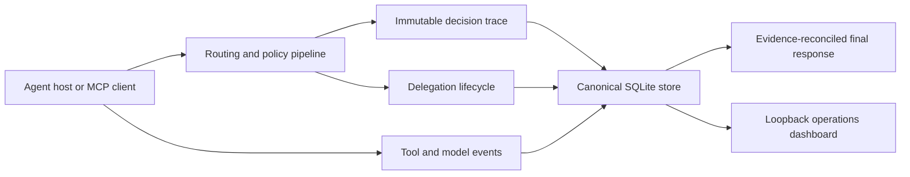

# Agency Runtime

Agency Runtime is a local control plane for specialist routing, delegation,
roster governance, and evidence about what an AI-agent host actually did. It
runs as a Python package, keeps durable state in SQLite, and can integrate with
Codex, Claude Code, Hermes, OpenClaw, LiteLLM, MCP clients, or an explicitly
configured generic command.

The project is prerelease software. Installation from this repository is the
canonical distribution path; there is no claim that a package has been
published to a public index.

## What is production-gated

Agency Runtime does not treat generated files as proof of a working host
integration. Host support has two independent dimensions:

1. **Contract coverage** proves bundle layouts, hook translations, native
   lifecycle commands, failure handling, MCP protocol behavior, and Windows /
   POSIX process construction in deterministic tests.
2. **Live maturity** advances only when native inventory proves discovery,
   registration, enablement, loading, and a canary where the host exposes one.

The v1 target matrix is Codex, Claude Code, Hermes, and OpenClaw on native
Windows and Ubuntu/WSL. All four have deterministic v1 host-contract coverage.
That does not by itself mean all four were live-tested on this machine or on
both operating systems.

### Current verification snapshot

This checkout was inspected on 2026-07-10:

| Environment / host | Contract evidence | Live evidence in this checkout |
|---|---|---|
| Codex on native Windows | Deterministic bundle, hook, MCP, lifecycle, `.CMD` launch, and rollback tests | Executable and current native state discovered; Agency Runtime not registered; load and canary unproven |
| Claude Code on native Windows | Deterministic bundle, hook, MCP, lifecycle, and rollback tests | Host absent |
| Hermes on native Windows | Deterministic native plugin, lifecycle, delegation, and rollback tests | Host absent |
| OpenClaw on native Windows | Deterministic JavaScript bundle, JSON bridge, lifecycle, runtime-inspection, and rollback tests | Host absent |
| Ubuntu / WSL target | POSIX command construction and isolated host contracts are covered; CI is configured for Ubuntu | WSL has Python, but this checkout has no WSL `pytest` or installed `agency` command, so no live Linux host or suite result is claimed |

Run `agency doctor --json` for current evidence. A local result may differ from
the snapshot above.

## Architecture



The selector fingerprints the active roster, full selector/provider
configuration, and companion policy. Cache and session reuse are rejected when
that fingerprint changes. Zero-signal requests abstain instead of selecting an
arbitrary agent. Every routing call receives a fresh trace identity even when
the selection result came from cache.

Runtime claims are failure-aware. A specialist load, delegation, model receipt,
or final response is not promoted to success merely because a tool was called.
Delegations correlate to a stable work-unit identity; failed prerequisites skip
dependents; and the final header is reconciled against canonical evidence rather
than trusting model-authored claims.

## Install

Python 3.10 or newer is required.

```bash
git clone https://github.com/Holeshot-Software-LLC/agency-runtime.git
cd agency-runtime
python -m pip install -e ".[dev]"
python -m pytest tests -q
agency configure --non-interactive --profile standard
agency install --all --dry-run
agency install --all
agency doctor
```

`agency install --all` discovers hosts from their executable or a current
native-state marker. A bare historical configuration directory is reported as
`stale-config` and is not selected automatically. Use `--agent` for an explicit
single-host operation:

```bash
agency install --agent codex --dry-run
agency install --agent codex
agency install --agent codex --rollback
agency install --agent codex --rollback --backup <retained-backup-path>
```

Installation also registers and starts the optional dashboard for the current
operating-system user: Task Scheduler on Windows and `systemd --user` on Linux.
It never requests an administrator/system service. Opt out without probing or
changing the service manager:

```bash
agency install --all --no-dashboard
```

The dry run writes nothing and includes the exact dashboard-service plan. A
real install stages a complete managed tree
atomically, moves the previous managed tree to a timestamped backup, and then
uses the host's native plugin lifecycle. Native registration failure returns a
nonzero partial-failure result; staged files are never reported as registered.
The installer never restarts a host automatically. In particular, OpenClaw
installation stops when a live gateway is proven and requires the operator to
schedule the restart.

The dashboard service is also fail-honest: if Task Scheduler or the Linux user
manager is unavailable, installation reports that component incomplete and
returns nonzero. The foreground dashboard remains usable, or rerun with
`--no-dashboard` after reviewing the limitation.

### Installed paths

| Host | Managed source path | Native lifecycle |
|---|---|---|
| Hermes | `~/.hermes/plugins/agency-preflight/` | `hermes plugins` |
| OpenClaw | `~/.agency-runtime/host-plugins/openclaw/agency-preflight/` | `openclaw plugins` |
| Codex | `~/.agency-runtime/marketplaces/codex/` | `codex plugin` |
| Claude Code | `~/.agency-runtime/marketplaces/claude/` | `claude plugin` |

Codex and Claude bundles contain their host-native marketplace manifest, plugin
manifest, hook manifest, and `.mcp.json`. OpenClaw receives a native JavaScript
package that invokes the installed Python runtime through bounded JSON. Hermes
receives its native Python plugin manifest and hook registration. Backups live
under `~/.agency-runtime/backups/<host>/`.

### Installation maturity

`agency doctor`, the installer JSON output, and the dashboard use the same
evidence vocabulary:

| Maturity | Meaning |
|---|---|
| `absent` | No executable, current native state, stale root, or managed stage was found |
| `stale-config` | A host root exists, but no executable or current native marker proves an installed host |
| `host-discovered` | An executable or current native state was found; Agency Runtime is not registered |
| `staged-not-registered` | The managed bundle exists, but native inventory does not prove registration |
| `registered-disabled` | Native inventory proves registration and disablement |
| `registered-enablement-unverified` | Registration is proven; enablement is not exposed or not proven |
| `enabled-runtime-unverified` | Registration and enablement are proven; a loaded runtime is not |
| `runtime-verified` | Native runtime inspection proves the integration loaded; `canary` is separately reported when supported |

Unknown values remain unknown. The system does not infer `loaded` or `canary`
from file existence.

### Enable, disable, and restore

```bash
agency off --agent codex --dry-run
agency off --agent codex
agency on --agent codex
```

These commands use native host lifecycle operations. They do not delete the
SQLite store, configuration, roster, or retained backups. A host restart may be
required. There is not yet a uniform in-conversation `/agency on|off` command,
and an already-running host is not claimed to reload unless its native contract
proves that behavior.

## Secure operations dashboard

The dashboard is installed as package data; Node.js and a separate web build
are not required. A normal `agency install` runs it as an optional user-scoped
service. Manage or open that service with:

```bash
agency dashboard service status
agency dashboard service open
agency dashboard service restart
agency dashboard service uninstall
agency dashboard service install --dry-run
agency dashboard service install
```

The foreground mode remains available on both Windows and Linux:

```bash
agency dashboard
agency dashboard --no-open
agency dashboard --port 7801 --db ~/.agency-runtime/agency.db
```

It binds only to loopback and creates a new high-entropy access token for each
process. Foreground mode prints the one-time URL. Service mode writes the
rotating token only to an owner-restricted runtime descriptor; the systemd unit,
scheduled task, process arguments, status output, and logs never contain it.
`agency dashboard service open` reads that descriptor and verifies the
authenticated health endpoint before opening a token-fragment URL. The browser
moves the token to session storage. The server validates `Host` and same-origin
requests, accepts mutation bodies only as JSON, sends restrictive browser
security headers, and requires exact confirmation phrases for roster, host,
retention, and configuration mutations.

The UI shows recent routing decisions, evidence tables, roster snapshots, host
maturity, an authoritative detected dependency graph, editable redacted
configuration, and a route/explain lab. It is not a remote multi-user control
plane and does not turn cold host inventory into a live verification claim.

Dashboard and CLI configuration changes use the same typed, locked, atomic
writer. Unknown fields, invalid types/ranges, embedded URL credentials, stale
browser revisions, and redaction-marker round trips are rejected before the
file is replaced. Direct secrets are write-only:

```bash
agency config set judge.model qwen3.5:2b
agency config set judge.api_key --prompt
agency config set judge.api_key --clear
```

The Settings view exposes runtime policy, provider order, judge/Ollama,
selector, adapter, privacy, storage, HTTP, and dashboard-service port settings.
Changing a restart-bound field is reported explicitly. Enabling content capture
or switching to `local-only` requires an additional operation-specific phrase.

Observability is metadata-only by default:

```yaml
observability:
  capture_content: false
  retention_days: 30
```

Set `capture_content: true` only after accepting the data-governance impact.
Supported callback capture is bounded and redacts common secrets, bearer tokens,
API keys, and email addresses; this is defensive redaction, not a guarantee that
all sensitive content can be recognized. Starting the dashboard applies the
configured runtime-retention window without deleting roster-governance data.

## MCP integration

`agency mcp` is a dependency-light MCP stdio server. It implements the
initialization handshake, tool discovery, bounded newline-delimited JSON-RPC,
structured errors, and these tools:

- `agency.preflight`
- `agency.search_agents`
- `agency.explain_selection`
- `agency.load_specialist`
- `agency.record_skill_loaded`
- `agency.delegate`
- `agency.finalize`
- `agency.status`

Run it directly for another MCP client:

```bash
agency mcp
agency mcp --db ~/.agency-runtime/alternate.db
```

The generated Codex and Claude bundles use the interpreter that installed
Agency Runtime and execute `python -m agency_runtime.server.mcp --stdio`.
Standard output is reserved for MCP protocol frames; diagnostics go to standard
error.

## LiteLLM activation

LiteLLM is optional and is not installed as a required dependency. For an SDK
process, register the callback once in every worker:

```python
from agency_runtime.adapters.litellm import register_litellm_callback

registration = register_litellm_callback()
if not registration.registered:
    raise RuntimeError(registration.reason)
```

Registration is thread-safe, idempotent, and preserves existing callbacks. It
injects preflight context where LiteLLM exposes a request hook and records
success or failure receipts without turning callback failures into model-traffic
failures.

For LiteLLM Proxy, merge the following fragment into its configuration so every
worker imports the callback object:

```yaml
litellm_settings:
  turn_off_message_logging: true
  callbacks: agency_runtime.adapters.litellm.callback.proxy_handler_instance
```

The equivalent programmatic fragment is returned by
`litellm_proxy_callback_config()`. Activation still depends on
`adapters.litellm.enabled`; `false` disables it, `true` enables it, and `auto`
uses gateway discovery. Confirm liveness and authentication with `agency doctor`
instead of assuming that importing the adapter registered it.

## Generic CLI fallback

Routing, search, explanation, roster governance, SQLite evidence, and the
dashboard work without a native host plugin:

```bash
agency route "review this authentication design"
agency explain "review this authentication design" --session-id demo
agency search "incident response"
```

For delegation to an unsupported CLI, configure a `GenericCLIBackend` or
`GenericAdapter` with an explicit argv command. The unconfigured generic backend
is deliberately unavailable; it never reports a no-op as completed.

## Quantitative routing evaluation

The versioned offline gate is reproducible and does not call a network model:

```bash
agency eval routing
agency eval routing --json --no-details
```

Corpus v1 currently contains 31 routing cases, 20 adversarial policy cases, and
17 delegation-detection cases. The checked-in v1 gates are:

| Area | Gate |
|---|---|
| Routing | precision@3 ≥ 0.75; required recall@3 ≥ 0.97; top-k accuracy ≥ 0.95; top-1 accuracy ≥ 0.90; forbidden-case rate = 0; abstention accuracy = 1.0 |
| Policy | required recall ≥ 0.95; case accuracy ≥ 0.95; forbidden-case rate = 0 |
| Delegation | decision accuracy ≥ 0.94; count accuracy ≥ 0.90; source accuracy ≥ 0.90 |
| Performance | deterministic narrowing and p95 ≤ 50 ms for the 1,000-agent microbenchmark |

These are release regression gates, not a claim of universal accuracy. Changing
the corpus, metric definitions, or thresholds requires a version change and a
durable decision record.

## Configuration and storage

Defaults:

- Configuration: `~/.agency-runtime/agency.yaml`
- SQLite: `~/.agency-runtime/agency.db`
- Profile: `standard`
- Dashboard service: installed for the current user by default; use
  `agency install --no-dashboard` to opt out
- Dashboard/content capture: disabled until explicitly opted in
- Runtime retention: 30 days when the dashboard starts, or when explicitly
  trimmed

Useful commands:

```bash
agency configure
agency configure --non-interactive --profile local-only
agency config show
agency config set judge.model qwen3.5:2b
agency config set judge.api_key --prompt
agency config validate
agency config path
agency dashboard service status
agency db stats
agency db trim --older-than-days 30 --dry-run
agency db trim --older-than-days 30
```

`local-only` disables network model adapters and still provides deterministic
token/policy routing. Provider order is configured; a failed or semantically
invalid provider response falls through without being promoted as a valid
selection.

Environment overrides include `AGENCY_CONFIG_PATH`, `AGENCY_DB_PATH`,
`AGENCY_CAPTURE_CONTENT`, `AGENCY_RETENTION_DAYS`, `AGENCY_JUDGE_MODEL`,
`AGENCY_JUDGE_BASE_URL`, `AGENCY_JUDGE_API_KEY`, `LITELLM_API_KEY`,
`OPENAI_API_KEY`, `ANTHROPIC_API_KEY`, and `OLLAMA_BASE_URL`.
`AGENCY_DASHBOARD_PORT` overrides the fixed user-service port.

## Roster governance

Imported JSON, YAML, or Markdown roster data moves through quarantine, diff,
approval, and activation. Nothing downloaded becomes active merely because a
sync ran.

```bash
agency source add examples/rosters/agents.json --name local-example
agency sync --dry-run
agency sync --review
agency roster approve <snapshot-id>
agency roster activate <snapshot-id>
agency roster list
```

`--auto-approve` is fail-closed and requires every enabled source to be marked
trusted. Repository examples are self-contained; the runtime does not depend on
a sibling repository.

## Development and release

```bash
python -m pip install -e ".[dev]"
python scripts/docs_metadata.py --check
python scripts/update_worklog.py --check
python scripts/verify_docs.py --require-tracker
python scripts/verify_tracker.py
python -m pytest tests -q
agency eval routing --json --no-details
git diff --check
```

See [CONTRIBUTING.md](CONTRIBUTING.md), [SECURITY.md](SECURITY.md),
[CHANGELOG.md](CHANGELOG.md), [troubleshooting](docs/TROUBLESHOOTING.md), and the
[release checklist](docs/RELEASE_CHECKLIST.md). Planning, worklog, and decision
records are indexed under [docs/](docs/roadmap/README.md).

## License

MIT. See [LICENSE](LICENSE).
